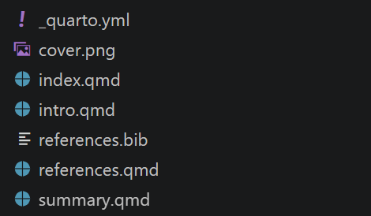

::: {.callout-note}
## Official Documentation
See the full Quarto book guide at **[quarto.org/docs/books](https://quarto.org/docs/books/)**.
:::

A Quarto Book is a set of `.qmd` files that are rendered together into a navigable document — perfect for lecture notes, a course handbook, or documentation.

You need the same setup as for a website. If you have not done this yet, follow [What you need — Website](beg_website_1.qmd) first.

---

## How a book is structured

When you create a Book project, Quarto generates this file structure automatically:



- `_quarto.yml` — defines the title, author, and the order of chapters
- `index.qmd` — the cover / preface page
- `intro.qmd`, `summary.qmd` — example chapters (you rename or replace these)
- `references.bib` — bibliography file for citations
- `references.qmd` — automatically generated references page

The `_quarto.yml` links everything together. For example:

```yaml
book:
  title: "My Lecture Notes"
  author: "Your Name"
  chapters:
    - index.qmd
    - intro.qmd
    - summary.qmd
    - references.qmd
```

Each `.qmd` file becomes one chapter. The order in the list is the order in the book.

---

::: {.callout-tip}
## ✅ Ready!
Continue with [Create a Book →](beg_book_2.qmd)
:::
