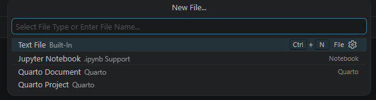
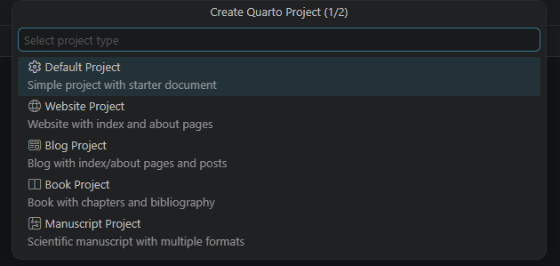
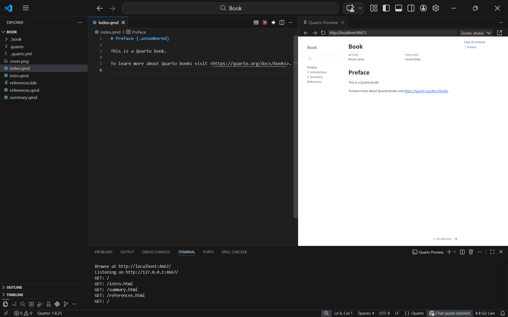
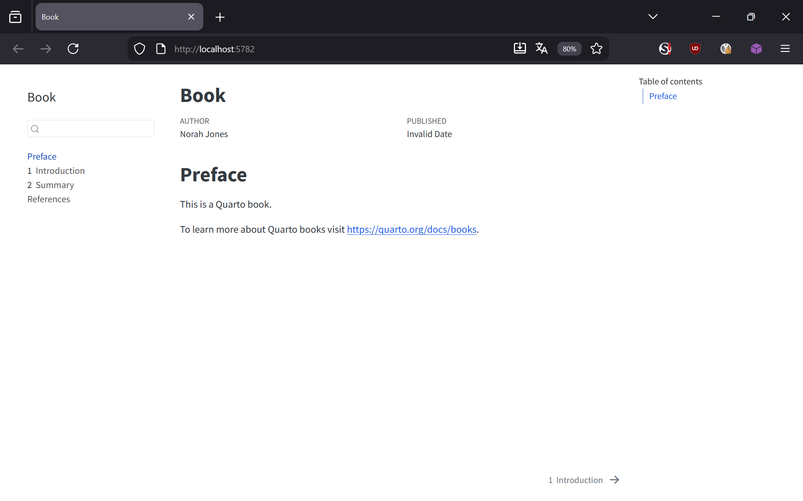

## 1 — Open a new folder in VS Code

Create a new empty folder (e.g. `my-book`) and open it in VS Code via **File → Open Folder**.
Click **Yes, I trust the authors** if the dialog appears.

---

## 2 — Create a Book project

**① Create a new Quarto project**



Go to **File → New File…**. A small menu appears — select **Quarto Project**.



Select **Book Project** and choose your project folder.

---

**② Your book files are ready**


Quarto created the full book structure:

- `_quarto.yml` — book settings and chapter order
- `index.qmd` — cover / preface
- `intro.qmd`, `summary.qmd` — example chapters
- `references.bib` — bibliography file
- `references.qmd` — references page

---

## 3 — Preview your book

**① Run quarto preview in the terminal**



Open the terminal (**View → Terminal**) and run:

```
quarto preview
```

The book builds and a live preview opens in VS Code and in your browser.

---

**② See the result in your browser**



Your book opens in the browser with:

- A **left sidebar** listing all chapters
- **Previous / Next** navigation at the bottom of each page
- A **table of contents** on the right for the current chapter

---

## 4 — Add and edit chapters

Open `_quarto.yml` to control which files are chapters and in what order:

```yaml
book:
  title: "My Lecture Notes"
  author: "Your Name"
  chapters:
    - index.qmd
    - intro.qmd
    - summary.qmd
    - references.qmd
```

Each entry is the filename of a `.qmd` file in your folder.
Add a new line to add a new chapter — create the matching `.qmd` file alongside it.

---

::: {.callout-tip}
## ✅ Your book is running!

- Edit any chapter `.qmd` file and save — the preview updates instantly
- Ready to publish? See [Publish your Website →](beg_website_3.qmd) — the `_book` folder works exactly like the `_site` folder
:::
