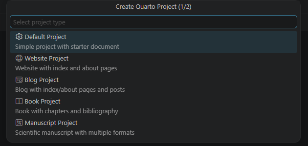
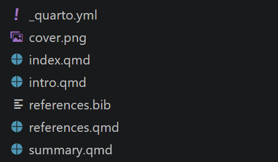
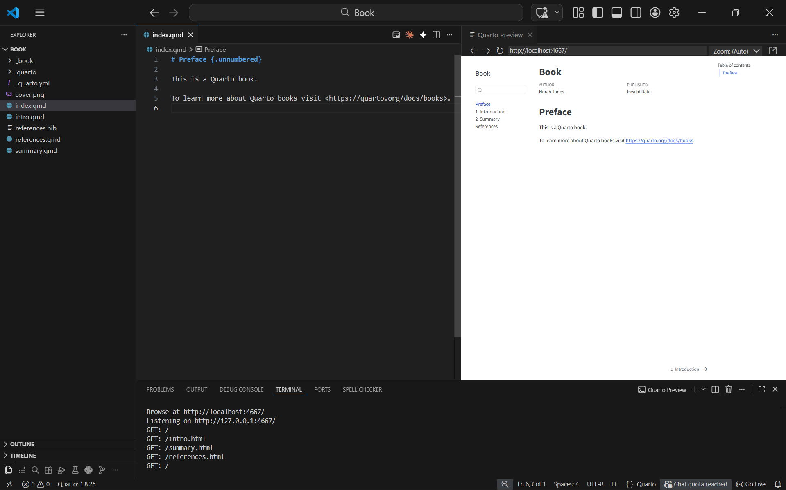
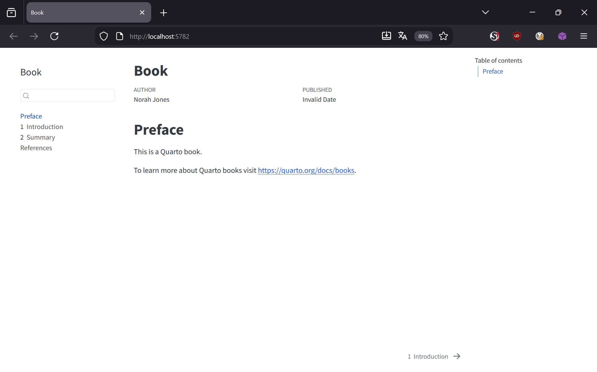

:::: {.content-visible when-profile="deutsch"}
## 1 – Einen neuen Ordner in VS Code öffnen

Lege einen neuen, leeren Ordner an (zum Beispiel `my-book`) und öffne ihn in VS Code über **File → Open Folder**.
Klicke auf **Yes, I trust the authors**, falls das Fenster erscheint.

---

## 2 – Ein Buchprojekt anlegen

**① Neues Quarto-Projekt anlegen**


Gehe auf **File → New File…**. Es erscheint ein kleines Menü, wähle dort **Quarto Project**.



Wähle **Book Project** und dann deinen Projektordner.

---

**② Die Dateien deines Buchs sind da**



Quarto hat den ganzen Aufbau des Buchs angelegt:

- `_quarto.yml`: Einstellungen des Buchs und Reihenfolge der Kapitel
- `index.qmd`: Titelseite bzw. Vorwort
- `intro.qmd`, `summary.qmd`: Beispielkapitel
- `references.bib`: Literaturdatei
- `references.qmd`: Seite mit dem Literaturverzeichnis

---

## 3 – Vorschau des Buchs

**① `quarto preview` im Terminal ausführen**



Öffne das Terminal (**View → Terminal**) und gib ein:

```
quarto preview
```

Das Buch wird gebaut, und eine Vorschau öffnet sich in VS Code und im Browser.

---

**② Das Ergebnis im Browser ansehen**



Dein Buch öffnet sich im Browser mit:

- einer **Leiste links**, die alle Kapitel auflistet
- **Zurück / Weiter** am Ende jeder Seite
- einem **Inhaltsverzeichnis** rechts für das aktuelle Kapitel

---

## 4 – Kapitel hinzufügen und ändern

In der `_quarto.yml` legst du fest, welche Dateien Kapitel sind und in welcher Reihenfolge:

```yaml
book:
  title: "Mein Vorlesungsskript"
  author: "Dein Name"
  chapters:
    - index.qmd
    - intro.qmd
    - summary.qmd
    - references.qmd
```

Jeder Eintrag ist der Dateiname einer `.qmd`-Datei in deinem Ordner.
Für ein neues Kapitel ergänzt du eine Zeile und legst die passende `.qmd`-Datei daneben an.

---

::: {.callout-tip}
## ✅ Dein Buch läuft!

- Ändere die `.qmd`-Datei eines Kapitels und speichere, die Vorschau zeigt es sofort
- Bereit zum Veröffentlichen? Siehe [Website veröffentlichen →](beg_website_3.qmd). Der Ordner `_book` funktioniert genau wie der Ordner `_site`
:::
::::

:::: {.content-visible when-profile="english"}
## 1 — Open a new folder in VS Code

Create a new empty folder (e.g. `my-book`) and open it in VS Code via **File → Open Folder**.
Click **Yes, I trust the authors** if the dialog appears.

---

## 2 — Create a Book project

**① Create a new Quarto project**


Go to **File → New File…**. A small menu appears — select **Quarto Project**.


Select **Book Project** and choose your project folder.

---

**② Your book files are ready**


Quarto created the full book structure:

- `_quarto.yml` — book settings and chapter order
- `index.qmd` — cover / preface
- `intro.qmd`, `summary.qmd` — example chapters
- `references.bib` — bibliography file
- `references.qmd` — references page

---

## 3 — Preview your book

**① Run quarto preview in the terminal**


Open the terminal (**View → Terminal**) and run:

```
quarto preview
```

The book builds and a live preview opens in VS Code and in your browser.

---

**② See the result in your browser**


Your book opens in the browser with:

- A **left sidebar** listing all chapters
- **Previous / Next** navigation at the bottom of each page
- A **table of contents** on the right for the current chapter

---

## 4 — Add and edit chapters

Open `_quarto.yml` to control which files are chapters and in what order:

```yaml
book:
  title: "My Lecture Notes"
  author: "Your Name"
  chapters:
    - index.qmd
    - intro.qmd
    - summary.qmd
    - references.qmd
```

Each entry is the filename of a `.qmd` file in your folder.
Add a new line to add a new chapter — create the matching `.qmd` file alongside it.

---

::: {.callout-tip}
## ✅ Your book is running!

- Edit any chapter `.qmd` file and save — the preview updates instantly
- Ready to publish? See [Publish your Website →](beg_website_3.qmd) — the `_book` folder works exactly like the `_site` folder
:::
::::

:::: {.content-visible when-profile="dansk"}
## 1 – Åbn en ny mappe i VS Code

Opret en ny tom mappe (for eksempel `min-bog`), og åbn den i VS Code via **File → Open Folder**.
Klik på **Yes, I trust the authors**, hvis dialogboksen vises.

---

## 2 – Opret et bogprojekt

**① Opret et nyt Quarto-projekt**


Gå til **File → New File…**. Der vises en lille menu, vælg **Quarto Project**.


Vælg **Book Project** og derefter din projektmappe.

---

**② Dine bogfiler er klar**


Quarto har oprettet hele bogens struktur:

- `_quarto.yml`: bogens indstillinger og kapitlernes rækkefølge
- `index.qmd`: forside eller forord
- `intro.qmd`, `summary.qmd`: eksempelkapitler
- `references.bib`: litteraturfil
- `references.qmd`: side med litteraturlisten

---

## 3 – Se en forhåndsvisning af bogen

**① Kør quarto preview i terminalen**


Åbn terminalen (**View → Terminal**), og kør:

```
quarto preview
```

Bogen bygges, og en forhåndsvisning åbnes i VS Code og i browseren.

---

**② Se resultatet i browseren**


Bogen åbnes i browseren med:

- et **sidepanel til venstre** med alle kapitler
- links til **forrige og næste** kapitel nederst på hver side
- en **indholdsfortegnelse** til højre for det aktuelle kapitel

---

## 4 – Tilføj og ret kapitler

Åbn `_quarto.yml` for at bestemme, hvilke filer der er kapitler, og i hvilken rækkefølge:

```yaml
book:
  title: "My Lecture Notes"
  author: "Your Name"
  chapters:
    - index.qmd
    - intro.qmd
    - summary.qmd
    - references.qmd
```

Hver post er filnavnet på en `.qmd`-fil i mappen.
Tilføj en linje for et nyt kapitel, og opret den tilhørende `.qmd`-fil.

---

::: {.callout-tip}
## ✅ Din bog kører!

- Ret i en kapitelfil, og gem, så opdateres forhåndsvisningen med det samme
- Klar til at udgive? Se [Udgiv webstedet →](beg_website_3.qmd). Mappen `_book` fungerer præcis som mappen `_site`
:::
::::

:::: {.content-visible when-profile="norsk"}
## 1 – Åpne en ny mappe i VS Code

Lag en ny tom mappe (for eksempel `min-bok`) og åpne den i VS Code via **File → Open Folder**.
Klikk på **Yes, I trust the authors** hvis dialogboksen kommer opp.

---

## 2 – Lag et bokprosjekt

**① Lag et nytt Quarto-prosjekt**


Gå til **File → New File…**. Det kommer en liten meny, velg **Quarto Project**.


Velg **Book Project** og deretter prosjektmappen din.

---

**② Bokfilene dine er klare**


Quarto har laget hele bokstrukturen:

- `_quarto.yml`: innstillingene for boken og rekkefølgen på kapitlene
- `index.qmd`: forside eller forord
- `intro.qmd`, `summary.qmd`: eksempelkapitler
- `references.bib`: litteraturfil
- `references.qmd`: side med litteraturlisten

---

## 3 – Forhåndsvis boken

**① Kjør quarto preview i terminalen**


Åpne terminalen (**View → Terminal**) og kjør:

```
quarto preview
```

Boken bygges, og en forhåndsvisning åpnes i VS Code og i nettleseren.

---

**② Se resultatet i nettleseren**


Boken åpnes i nettleseren med:

- et **sidefelt til venstre** med alle kapitlene
- lenker til **forrige og neste** kapittel nederst på hver side
- en **innholdsfortegnelse** til høyre for det gjeldende kapittelet

---

## 4 – Legg til og endre kapitler

Åpne `_quarto.yml` for å bestemme hvilke filer som er kapitler, og i hvilken rekkefølge:

```yaml
book:
  title: "My Lecture Notes"
  author: "Your Name"
  chapters:
    - index.qmd
    - intro.qmd
    - summary.qmd
    - references.qmd
```

Hver oppføring er filnavnet til en `.qmd`-fil i mappen.
Legg til en linje for et nytt kapittel, og lag den tilhørende `.qmd`-filen.

---

::: {.callout-tip}
## ✅ Boken din kjører!

- Endre en kapittelfil og lagre, så oppdateres forhåndsvisningen med en gang
- Klar til å publisere? Se [Publiser nettstedet →](beg_website_3.qmd). Mappen `_book` fungerer akkurat som mappen `_site`
:::
::::

:::: {.content-visible when-profile="svenska"}
## 1 – Öppna en ny mapp i VS Code

Skapa en ny tom mapp (till exempel `min-bok`) och öppna den i VS Code via **File → Open Folder**.
Klicka på **Yes, I trust the authors** om dialogrutan visas.

---

## 2 – Skapa ett bokprojekt

**① Skapa ett nytt Quarto-projekt**


Gå till **File → New File…**. En liten meny visas, välj **Quarto Project**.


Välj **Book Project** och sedan din projektmapp.

---

**② Bokens filer är klara**


Quarto har skapat hela bokens struktur:

- `_quarto.yml`: bokens inställningar och kapitlens ordning
- `index.qmd`: omslag eller förord
- `intro.qmd`, `summary.qmd`: exempelkapitel
- `references.bib`: litteraturfil
- `references.qmd`: sida med litteraturförteckningen

---

## 3 – Förhandsgranska boken

**① Kör quarto preview i terminalen**


Öppna terminalen (**View → Terminal**) och kör:

```
quarto preview
```

Boken byggs och en förhandsgranskning öppnas i VS Code och i webbläsaren.

---

**② Se resultatet i webbläsaren**


Boken öppnas i webbläsaren med:

- ett **sidofält till vänster** med alla kapitel
- länkar till **föregående och nästa** kapitel längst ner på varje sida
- en **innehållsförteckning** till höger för det aktuella kapitlet

---

## 4 – Lägg till och ändra kapitel

Öppna `_quarto.yml` för att bestämma vilka filer som är kapitel och i vilken ordning:

```yaml
book:
  title: "My Lecture Notes"
  author: "Your Name"
  chapters:
    - index.qmd
    - intro.qmd
    - summary.qmd
    - references.qmd
```

Varje post är filnamnet på en `.qmd`-fil i mappen.
Lägg till en rad för ett nytt kapitel och skapa den tillhörande `.qmd`-filen.

---

::: {.callout-tip}
## ✅ Din bok är igång!

- Ändra i en kapitelfil och spara, så uppdateras förhandsgranskningen direkt
- Redo att publicera? Se [Publicera webbplatsen →](beg_website_3.qmd). Mappen `_book` fungerar precis som mappen `_site`
:::
::::
