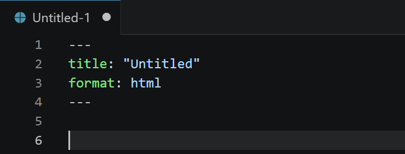
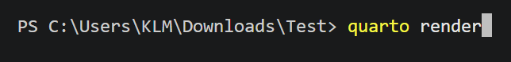

## 1 — Create a new Quarto file

**① Open the New File dialog**


In VS Code go to **File → New File…**.
A small menu appears. Select **Quarto Document**.

---

**② Your new file opens with an existing header**



VS Code creates a new file with a basic settings block already filled in.
Save it with a name like `exercises.qmd` (**File → Save** or `Ctrl+S`).

---

## 2 — Set the output format

**① Edit the header block**

The top of the file controls the output format. Change it to:

```yaml
---
title: "Exercise Sheet 1"
author: "Your Name"
format: pdf
---
```

This tells Quarto: create a PDF with this title and author name.

::: {.callout-note}
PDF output requires TinyTeX — see [What you need](beg_exercise_1.qmd) if you have not installed it yet.
For HTML output, change `format: pdf` to `format: html` and no extra tools are needed.
:::

---

## 3 — Write your exercises

Below the header block, write your content using normal text.
Use `##` for section headings. Leave a blank line between paragraphs.

```markdown
## Exercise 1

Calculate the derivative of $f(x) = x^2 + 3x$.

## Exercise 2

Explain the difference between a list and a dictionary in Python.
```

---

## 4 — Add a code example (optional)

To show Python code that is displayed but not executed:

````markdown
```python
x = [1, 2, 3, 4]
print(sum(x))
```
````

---

## 5 — Render your sheet

Open the **Terminal** via **View → Terminal** and run:

```{.bash filename="Terminal"}
quarto render exercises.qmd
```



Quarto creates the output file (PDF or HTML) in the same folder. Open it from your file explorer.

::: {.callout-note collapse="true"}
## 🔍 Preview while writing

Instead of `quarto render`, you can use:

```{.bash filename="Terminal"}
quarto preview exercises.qmd
```

This opens a live preview in your browser that updates every time you save the file.
:::

---

::: {.callout-tip}
## ✅ Your exercise sheet is ready!

- Want to export as HTML, Word, or PDF from the same file? See [Other Output Formats →](beg_exercise_3.qmd)
- Want students to run and edit Python code in the browser? See [Interactive Code →](beg_extensions.qmd)
:::
