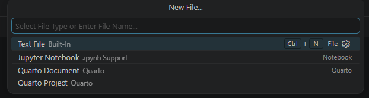
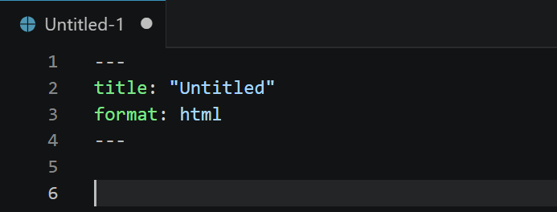
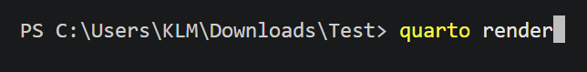

:::: {.content-visible when-profile="deutsch"}
## 1 – Eine neue Quarto-Datei anlegen

**① Das Fenster „New File“ öffnen**



Gehe in VS Code auf **File → New File…**.
Es erscheint ein kleines Menü. Wähle **Quarto Document**.

---

**② Die Datei öffnet sich mit einem fertigen Kopf**



VS Code legt eine neue Datei an, in der ein einfacher Einstellungsblock schon ausgefüllt ist.
Speichere sie unter einem Namen wie `exercises.qmd` (**File → Save** oder `Strg+S`).

---

## 2 – Das Ausgabeformat festlegen

**① Den Kopf der Datei ändern**

Der Anfang der Datei bestimmt das Ausgabeformat. Ändere ihn so:

```yaml
---
title: "Übungsblatt 1"
author: "Dein Name"
format: pdf
---
```

Das sagt Quarto: Erzeuge ein PDF mit diesem Titel und diesem Namen.

::: {.callout-note}
Für PDF brauchst du TinyTeX, siehe [Was du brauchst](beg_exercise_1.qmd), falls du es noch nicht installiert hast.
Für HTML änderst du `format: pdf` in `format: html`, dann brauchst du keine weiteren Werkzeuge.
:::

---

## 3 – Die Aufgaben schreiben

Unter den Kopf schreibst du deinen Inhalt als normalen Text.
Mit `##` beginnt eine Überschrift. Zwischen Absätzen steht eine Leerzeile.

```markdown
## Aufgabe 1

Berechne die Ableitung von $f(x) = x^2 + 3x$.

## Aufgabe 2

Erkläre den Unterschied zwischen einer Liste und einem Dictionary in Python.
```

---

## 4 – Ein Code-Beispiel einfügen (wenn du möchtest)

So zeigst du Python-Code, der angezeigt, aber nicht ausgeführt wird:

````markdown
```python
x = [1, 2, 3, 4]
print(sum(x))
```
````

---

## 5 – Das Blatt bauen

Öffne das **Terminal** über **View → Terminal** und gib ein:

```{.bash filename="Terminal"}
quarto render exercises.qmd
```



Quarto legt die Ausgabedatei (PDF oder HTML) im selben Ordner ab. Öffne sie aus dem Datei-Explorer.

::: {.callout-note collapse="true"}
## 🔍 Vorschau beim Schreiben

Statt `quarto render` kannst du auch das hier benutzen:

```{.bash filename="Terminal"}
quarto preview exercises.qmd
```

Das öffnet im Browser eine Vorschau, die sich bei jedem Speichern der Datei aktualisiert.
:::

---

::: {.callout-tip}
## ✅ Dein Übungsblatt ist fertig!

- Aus derselben Datei HTML, Word oder PDF erzeugen? Siehe [Andere Ausgabeformate →](beg_exercise_3.qmd)
- Sollen Studierende Python-Code im Browser ausführen und verändern? Siehe [Interaktiver Code →](beg_extensions.qmd)
:::
::::

:::: {.content-visible when-profile="english"}
## 1 — Create a new Quarto file

**① Open the New File dialog**


In VS Code go to **File → New File…**.
A small menu appears. Select **Quarto Document**.

---

**② Your file opens with an existing header**


VS Code creates a new file with a basic settings block already filled in.
Save it with a name like `exercises.qmd` (**File → Save** or `Ctrl+S`).

---

## 2 — Set the output format

**① Edit the header block**

The top of the file controls the output format. Change it to:

```yaml
---
title: "Exercise Sheet 1"
author: "Your Name"
format: pdf
---
```

This tells Quarto: create a PDF with this title and author name.

::: {.callout-note}
PDF output requires TinyTeX — see [What you need](beg_exercise_1.qmd) if you have not installed it yet.
For HTML output, change `format: pdf` to `format: html` and no extra tools are needed.
:::

---

## 3 — Write your exercises

Below the header block, write your content using normal text.
Use `##` for section headings. Leave a blank line between paragraphs.

```markdown
## Exercise 1

Calculate the derivative of $f(x) = x^2 + 3x$.

## Exercise 2

Explain the difference between a list and a dictionary in Python.
```

---

## 4 — Add a code example (optional)

To show Python code that is displayed but not executed:

````markdown
```python
x = [1, 2, 3, 4]
print(sum(x))
```
````

---

## 5 — Render your sheet

Open the **Terminal** via **View → Terminal** and run:

```{.bash filename="Terminal"}
quarto render exercises.qmd
```


Quarto creates the output file (PDF or HTML) in the same folder. Open it from your file explorer.

::: {.callout-note collapse="true"}
## 🔍 Preview while writing

Instead of `quarto render`, you can use:

```{.bash filename="Terminal"}
quarto preview exercises.qmd
```

This opens a live preview in your browser that updates every time you save the file.
:::

---

::: {.callout-tip}
## ✅ Your exercise sheet is ready!

- Want to export as HTML, Word, or PDF from the same file? See [Other Output Formats →](beg_exercise_3.qmd)
- Want students to run and edit Python code in the browser? See [Interactive Code →](beg_extensions.qmd)
:::
::::

:::: {.content-visible when-profile="dansk"}
## 1 – Opret en ny Quarto-fil

**① Åbn dialogen New File**


Gå i VS Code til **File → New File…**.
Der vises en lille menu. Vælg **Quarto Document**.

---

**② Filen åbnes med et færdigt hoved**


VS Code opretter en ny fil, hvor en enkel indstillingsblok allerede er udfyldt.
Gem den med et navn som `exercises.qmd` (**File → Save** eller `Ctrl+S`).

---

## 2 – Angiv outputformat

**① Ret hovedet**

Toppen af filen styrer outputformatet. Ret den til:

```yaml
---
title: "Exercise Sheet 1"
author: "Your Name"
format: pdf
---
```

Det fortæller Quarto: lav en PDF med denne titel og forfatter.

::: {.callout-note}
PDF kræver TinyTeX, se [Det skal du bruge](beg_exercise_1.qmd), hvis du ikke har installeret det endnu.
Til HTML retter du `format: pdf` til `format: html`, så skal der ikke bruges ekstra værktøjer.
:::

---

## 3 – Skriv dine opgaver

Under hovedet skriver du indholdet som almindelig tekst.
Brug `##` til overskrifter. Lad der være en tom linje mellem afsnittene.

```markdown
## Exercise 1

Calculate the derivative of $f(x) = x^2 + 3x$.

## Exercise 2

Explain the difference between a list and a dictionary in Python.
```

---

## 4 – Tilføj et kodeeksempel (valgfrit)

Sådan viser du Python-kode, der vises, men ikke køres:

````markdown
```python
x = [1, 2, 3, 4]
print(sum(x))
```
````

---

## 5 – Render arket

Åbn **terminalen** via **View → Terminal**, og kør:

```{.bash filename="Terminal"}
quarto render exercises.qmd
```


Quarto opretter outputfilen (PDF eller HTML) i den samme mappe. Åbn den fra din filoversigt.

::: {.callout-note collapse="true"}
## 🔍 Forhåndsvisning, mens du skriver

I stedet for `quarto render` kan du bruge:

```{.bash filename="Terminal"}
quarto preview exercises.qmd
```

Så åbnes en forhåndsvisning i browseren, som opdateres, hver gang du gemmer filen.
:::

---

::: {.callout-tip}
## ✅ Dit opgaveark er færdigt!

- Vil du eksportere som HTML, Word eller PDF fra den samme fil? Se [Andre outputformater →](beg_exercise_3.qmd)
- Vil du have, at de studerende kører og ændrer Python-kode i browseren? Se [Interaktiv kode →](beg_extensions.qmd)
:::
::::

:::: {.content-visible when-profile="norsk"}
## 1 – Lag en ny Quarto-fil

**① Åpne dialogen New File**


Gå i VS Code til **File → New File…**.
Det kommer en liten meny. Velg **Quarto Document**.

---

**② Filen åpnes med et ferdig hode**


VS Code lager en ny fil der en enkel innstillingsblokk allerede er fylt ut.
Lagre den med et navn som `exercises.qmd` (**File → Save** eller `Ctrl+S`).

---

## 2 – Angi utdataformat

**① Endre hodet**

Toppen av filen styrer utdataformatet. Endre den til:

```yaml
---
title: "Exercise Sheet 1"
author: "Your Name"
format: pdf
---
```

Dette sier til Quarto: lag en PDF med denne tittelen og forfatteren.

::: {.callout-note}
PDF krever TinyTeX, se [Dette trenger du](beg_exercise_1.qmd) hvis du ikke har installert det ennå.
For HTML endrer du `format: pdf` til `format: html`, da trengs ingen ekstra verktøy.
:::

---

## 3 – Skriv oppgavene dine

Under hodet skriver du innholdet som vanlig tekst.
Bruk `##` til overskrifter. La det stå en tom linje mellom avsnittene.

```markdown
## Exercise 1

Calculate the derivative of $f(x) = x^2 + 3x$.

## Exercise 2

Explain the difference between a list and a dictionary in Python.
```

---

## 4 – Legg til et kodeeksempel (valgfritt)

Slik viser du Python-kode som vises, men ikke kjøres:

````markdown
```python
x = [1, 2, 3, 4]
print(sum(x))
```
````

---

## 5 – Rendre arket

Åpne **terminalen** via **View → Terminal** og kjør:

```{.bash filename="Terminal"}
quarto render exercises.qmd
```


Quarto lager utdatafilen (PDF eller HTML) i samme mappe. Åpne den fra filutforskeren.

::: {.callout-note collapse="true"}
## 🔍 Forhåndsvis mens du skriver

I stedet for `quarto render` kan du bruke:

```{.bash filename="Terminal"}
quarto preview exercises.qmd
```

Da åpnes en forhåndsvisning i nettleseren som oppdateres hver gang du lagrer filen.
:::

---

::: {.callout-tip}
## ✅ Oppgavearket ditt er ferdig!

- Vil du eksportere som HTML, Word eller PDF fra samme fil? Se [Andre utdataformater →](beg_exercise_3.qmd)
- Vil du at studentene skal kjøre og endre Python-kode i nettleseren? Se [Interaktiv kode →](beg_extensions.qmd)
:::
::::

:::: {.content-visible when-profile="svenska"}
## 1 – Skapa en ny Quarto-fil

**① Öppna dialogen New File**


Gå i VS Code till **File → New File…**.
En liten meny visas. Välj **Quarto Document**.

---

**② Filen öppnas med ett färdigt huvud**


VS Code skapar en ny fil där ett enkelt inställningsblock redan är ifyllt.
Spara den med ett namn som `exercises.qmd` (**File → Save** eller `Ctrl+S`).

---

## 2 – Ange utdataformat

**① Ändra i huvudet**

Början av filen styr utdataformatet. Ändra den till:

```yaml
---
title: "Exercise Sheet 1"
author: "Your Name"
format: pdf
---
```

Det säger till Quarto: skapa en PDF med den här titeln och författaren.

::: {.callout-note}
PDF kräver TinyTeX, se [Vad du behöver](beg_exercise_1.qmd) om du inte har installerat det än.
För HTML ändrar du `format: pdf` till `format: html`, då behövs inga extra verktyg.
:::

---

## 3 – Skriv dina uppgifter

Under huvudet skriver du innehållet som vanlig text.
Använd `##` för rubriker. Lämna en tom rad mellan styckena.

```markdown
## Exercise 1

Calculate the derivative of $f(x) = x^2 + 3x$.

## Exercise 2

Explain the difference between a list and a dictionary in Python.
```

---

## 4 – Lägg till ett kodexempel (valfritt)

Så här visar du Python-kod som visas men inte körs:

````markdown
```python
x = [1, 2, 3, 4]
print(sum(x))
```
````

---

## 5 – Rendera bladet

Öppna **terminalen** via **View → Terminal** och kör:

```{.bash filename="Terminal"}
quarto render exercises.qmd
```


Quarto skapar utdatafilen (PDF eller HTML) i samma mapp. Öppna den från filutforskaren.

::: {.callout-note collapse="true"}
## 🔍 Förhandsgranska medan du skriver

I stället för `quarto render` kan du använda:

```{.bash filename="Terminal"}
quarto preview exercises.qmd
```

Då öppnas en förhandsgranskning i webbläsaren som uppdateras varje gång du sparar filen.
:::

---

::: {.callout-tip}
## ✅ Ditt övningsblad är klart!

- Vill du exportera som HTML, Word eller PDF från samma fil? Se [Andra utdataformat →](beg_exercise_3.qmd)
- Vill du att studenterna ska köra och ändra Python-kod i webbläsaren? Se [Interaktiv kod →](beg_extensions.qmd)
:::
::::
