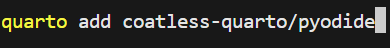
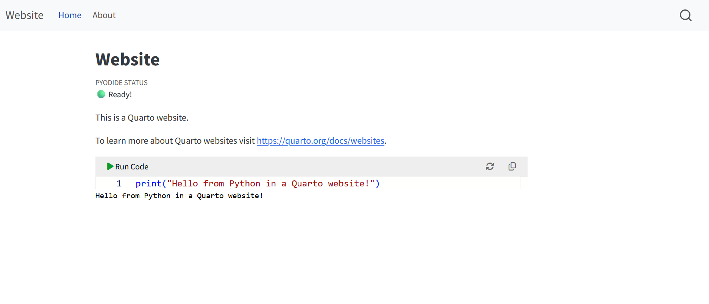

::: {.callout-note}
## What are extensions?
Extensions add extra features to Quarto that are not built in. You install them once per project folder.
See the full list at **[quarto.org/docs/extensions](https://quarto.org/docs/extensions/)**.
:::

**Pyodide** lets students run and edit Python code directly in the browser — no Python installation needed on their computer. You write the code once; they click **Run Code**.

::: {.callout-warning}
## HTML only
Interactive code requires **HTML output**. It works in websites (`format: html`) and books, but not in PDF or Word documents.
:::

---

## 1 — Install the Pyodide extension

**① Open the Terminal in VS Code**

Open the **Terminal** (the command line interface) via **View → Terminal**. A panel opens at the bottom of the screen. Make sure the path shown matches your project folder.

---

**② Run the install command**



```{.bash filename="Terminal"}
quarto add coatless-quarto/pyodide
```

Wait until it finishes — it will ask you to confirm once. This only needs to be done **once per project folder**.

---

## 2 — Enable it in your file

Add a `filters:` line to the header block of your `.qmd` file:

```yaml
---
title: "My Page"
format: html
filters:
  - coatless-quarto/pyodide
---
```

---

## 3 — Add an interactive code block

Instead of a regular code block, use `{pyodide-python}`:

````markdown
```{pyodide-python}
x = [1, 2, 3, 4, 5]
print(sum(x))
```
````

Students can edit this code directly in the browser and run it with the **Run Code** button.

---

## 4 — See the result

**① Preview your page**

Run `quarto preview` in the Terminal. The code block appears in the browser with a Run Code button.

---

**② The interactive block in the browser**



At the top of the page Quarto shows **PYODIDE STATUS: Ready!** when Python has loaded.
Students can click **Run Code**, edit the code, and run it again — all without installing anything.

---

::: {.callout-tip}
## Want students to fill in solutions?
The `py-exercise` extension adds code blocks with hidden automated tests — students see whether their solution passes or fails. You can see a live example on the **Example Page** of this tutorial.
:::
