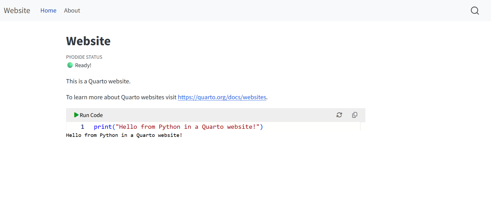

::: {.callout-note}
## What are extensions?
Extensions add extra features to Quarto that are not built in. You install them once per project folder.
See the full list at **[quarto.org/docs/extensions](https://quarto.org/docs/extensions/)**.
:::

**Pyodide** lets students run and edit Python code directly in the browser — no Python installation needed on their computer. You write the code once; they click **Run Code**.

This tutorial uses `pyodide-interaktiv`, a fork of the `coatless-quarto/pyodide` extension built for this project. It runs Python in a **Web Worker** instead of on the browser's main thread, which is what makes real `input()`, animations, a Stop button and AI feedback possible — more on that in the last section.

::: {.callout-warning}
## HTML only
Interactive code requires **HTML output**. It works in websites (`format: html`) and books, but not in PDF or Word documents.
:::

---

## 1 — Install the pyodide-interaktiv extension

`pyodide-interaktiv` is published at **[github.com/Erasmus-CTM/pyodide-interaktiv](https://github.com/Erasmus-CTM/pyodide-interaktiv)** — but the repository is currently **private**, which decides how you install it:

::: {.panel-tabset}
## No repo access (for now)

**① Copy the extension folder**

Copy `_extensions/Erasmus-CTM/pyodide-interaktiv/` from this project into your own project's `_extensions/` folder.

That's it — no `quarto add` step needed for a vendored extension, Quarto picks it up automatically.

## Once the repo is public

Installing will be a single command, like any other extension:

**① Open the Terminal in VS Code**

Open the **Terminal** (the command line interface) via **View → Terminal**. A panel opens at the bottom of the screen. Make sure the path shown matches your project folder.

**② Run the install command**

```{.bash filename="Terminal"}
quarto add Erasmus-CTM/pyodide-interaktiv
```

Wait until it finishes — it will ask you to confirm once. This only needs to be done **once per project folder**.
:::

---

## 2 — Enable it in your file

Add a `filters:` line to the header block of your `.qmd` file:

```yaml
---
title: "My Page"
format: html
filters:
  - pyodide-interaktiv
---
```

---

## 3 — Add an interactive code block

Instead of a regular code block, use `{pyodide-python}`:

````markdown
```{pyodide-python}
x = [1, 2, 3, 4, 5]
print(sum(x))
```
````

Students can edit this code directly in the browser and run it with the **Run Code** button.

---

## 4 — See the result

**① Preview your page**

Run `quarto preview` in the Terminal. The code block appears in the browser with a Run Code button.

---

**② The interactive block in the browser**



At the top of the page Quarto shows **PYODIDE STATUS: Ready!** when Python has loaded.
Students can click **Run Code**, edit the code, and run it again — all without installing anything.

---

::: {.callout-tip}
## Want students to fill in solutions?
The `py-exercise` extension adds code blocks with hidden automated tests — students see whether their solution passes or fails. The `math-exercise` extension does the same for symbolic/numeric answers, checked with SymPy instead of unit tests. Both have live examples on the **Example Page** of this tutorial.
:::

---

## 5 — What pyodide-interaktiv gives you

Because `pyodide-interaktiv` executes Python in a **Web Worker** instead of on the browser's main thread, you get several things for free that the base `coatless-quarto/pyodide` extension doesn't have:

- **Real `input()`** — a cell can pause and wait for typed input without freezing the page.
- **Animations** — a Matplotlib `FuncAnimation` plays as an interactive player, from the same code you would write in a local IDE.
- **Safe infinite loops** — an accidental `while True:` no longer locks up the tab; a Stop button cancels the worker.
- **AI feedback** — every cell gets a Feedback button that explains what went wrong, with hints that get more concrete on each click.
- **A responsive page** — a long calculation no longer freezes the tab, because it happens off the main thread.

Cells also share one Python session per page, so a later cell can reuse a variable or `import` from an earlier one.

You can try `input()` and cell state-sharing live on the [Code page](../../beg/Qmd Files/Example Page/ep_code.html), and the animation on the [Visualizations page](../../beg/Qmd Files/Example Page/ep_visuals.html) of the Example Page.
