::: {.callout-note}
## Official Documentation
Full installation instructions are also available at **[quarto.org/docs/get-started](https://quarto.org/docs/get-started/)**.
:::

You need three things installed. This takes about 10–15 minutes.

---

## 1 — Install VS Code

**① Go to the VS Code website and download the installer**

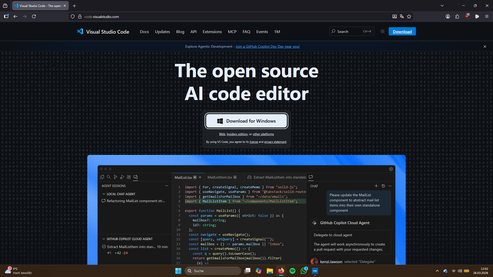

Go to [code.visualstudio.com](https://code.visualstudio.com) and click the large **Download for Windows** button. The file will download to your Downloads folder.

---

**② Run the installer**

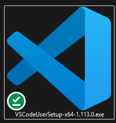

Double-click the downloaded file (it looks like the VS Code logo with a green checkmark).

---

**③ Make sure "Add to PATH" is checked**

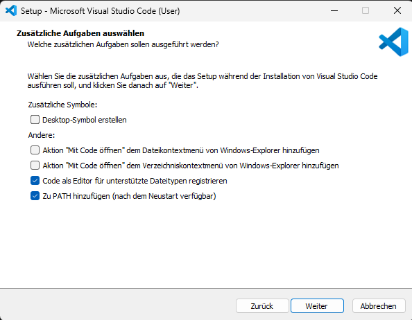

During installation you will see a screen with checkboxes. Make sure **"Add to PATH"** is ticked — this is important for Quarto to work correctly. Then click **Next**.

---

**④ Finish the installation**

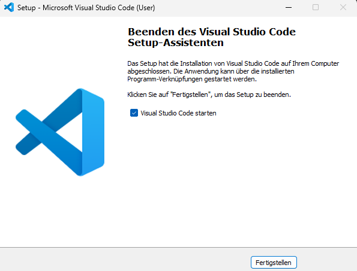

Click **Finish**. VS Code will open automatically.

::: {.callout-note collapse="true"}
## 🔍 Detailed: every VS Code installer screen

**License agreement** — select "I accept" and click Next.

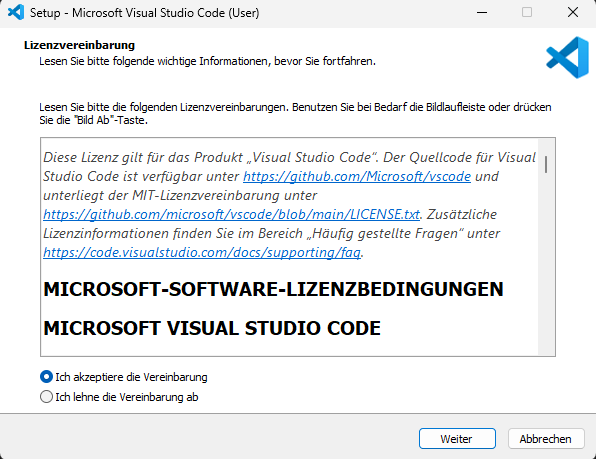

**Destination folder** — leave the default path and click Next.

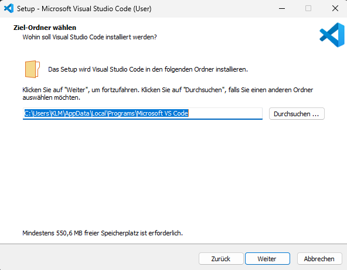

**Start menu folder** — leave as is and click Next.

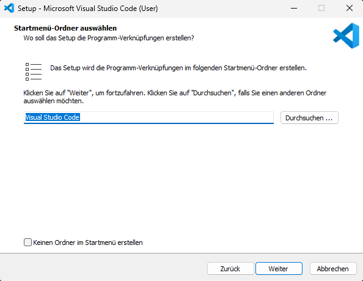

**Summary screen** — review and click Install.

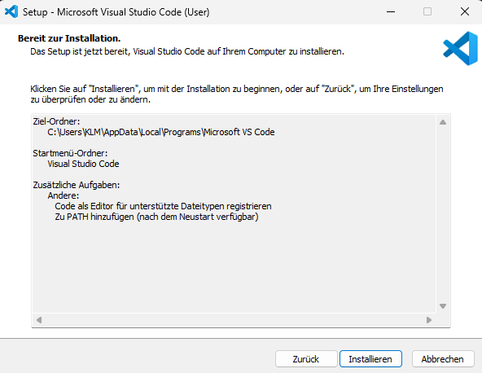

**Installation progress** — wait for it to complete.

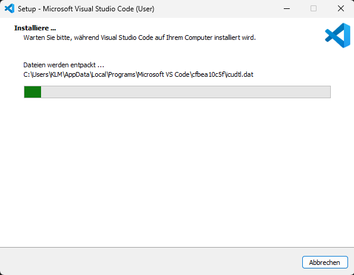
:::

---

## 2 — Install Quarto

**① Go to the Quarto website and download the installer**

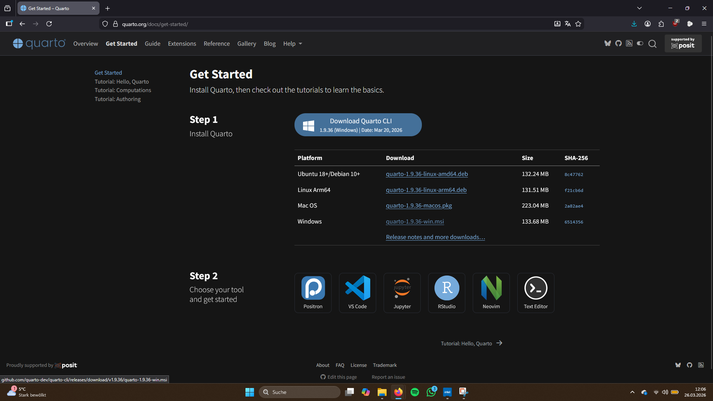

Go to [quarto.org/docs/get-started](https://quarto.org/docs/get-started/) and click the **Download Quarto CLI** button under Step 1. Choose the Windows installer.

---

**② Run the Quarto installer**

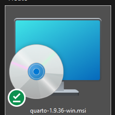

Double-click the downloaded `.msi` file and follow the installer. You can click through all screens with the default settings.

---

**③ Finish**

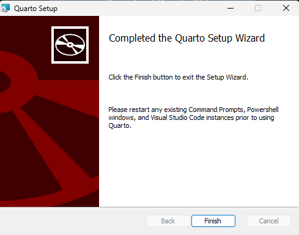

Click **Finish**. Quarto is now installed.

::: {.callout-note collapse="true"}
## 🔍 Detailed: every Quarto installer screen

**Welcome screen** — click Next.

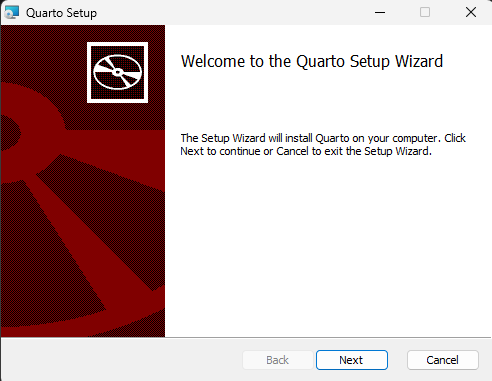

**Installation scope** — "Install just for you" is fine for most users.

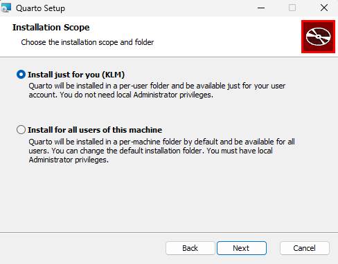

**Destination folder** — leave the default and click Next.

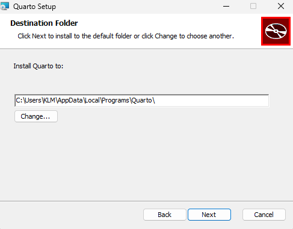

**Installation progress** — wait for it to complete.

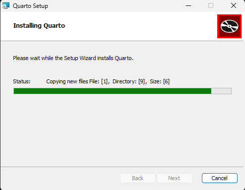
:::

---

## 3 — Install the Quarto Extension in VS Code

**① Search for and install the Quarto extension**

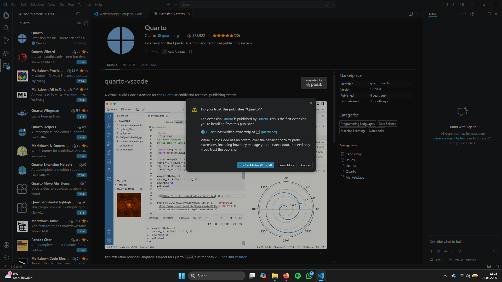

In VS Code, click the **Extensions** icon in the left sidebar (four squares). Search for **Quarto**, click on the result, and click **Trust Publisher & Install** in the dialog that appears.

---

::: {.callout-tip}
## ✅ All done — ready to build!
Continue with [Create a Website →](beg_website_2.qmd)
:::
