:::: {.content-visible when-profile="deutsch"}
::: {.callout-note}
## Offizielle Dokumentation
Die vollständige Installationsanleitung gibt es auch unter **[quarto.org/docs/get-started](https://quarto.org/docs/get-started/)**.
:::

::: {.callout-tip}
## Lieber eine Kurzfassung?
Dieses Kapitel gibt es als vierseitiges [PDF-Cheatsheet](beg_website_cheatsheet.qmd): Einrichten, Inhalte schreiben und Veröffentlichen, knapp gefasst zum Ausdrucken oder Nachschlagen.
:::

Du musst drei Dinge installieren. Das dauert etwa 10–15 Minuten.
Die Bildschirmfotos sind in allen Sprachen dieselben (englisches Windows).

---

## 1 – VS Code installieren

**① Auf der VS-Code-Website das Installationsprogramm herunterladen**

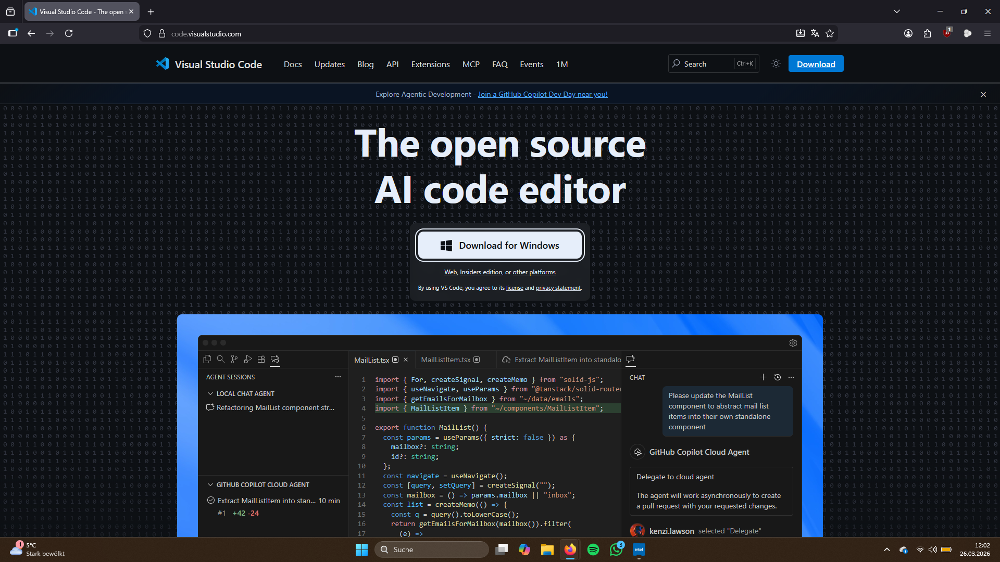

Öffne [code.visualstudio.com](https://code.visualstudio.com) und klicke auf den großen Knopf **Download for Windows**. Die Datei landet in deinem Download-Ordner.

---

**② Installationsprogramm starten**

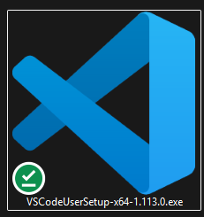

Doppelklicke auf die heruntergeladene Datei (das VS-Code-Symbol mit grünem Haken).

---

**③ „Add to PATH“ muss angehakt sein**

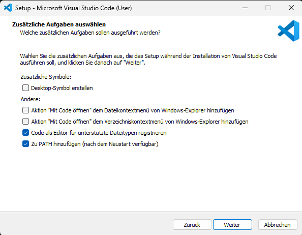

Während der Installation erscheint eine Seite mit Kästchen. Achte darauf, dass **„Add to PATH“** angehakt ist, sonst funktioniert Quarto später nicht richtig. Dann auf **Next** klicken.

---

**④ Installation abschließen**

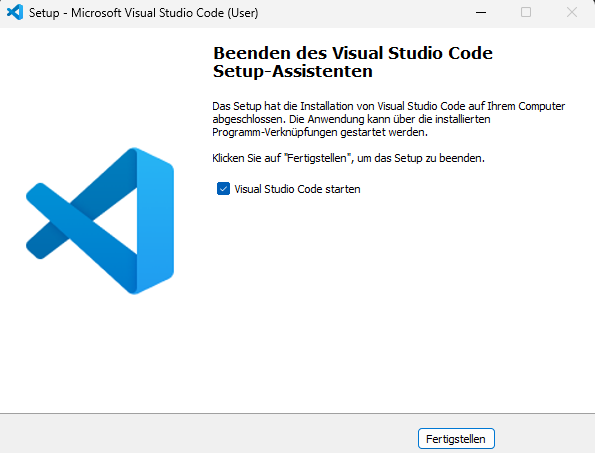

Klicke auf **Finish**. VS Code öffnet sich von selbst.

::: {.callout-note collapse="true"}
## 🔍 Im Detail: jede Seite des VS-Code-Installationsprogramms

**Lizenzvereinbarung**: „I accept“ auswählen und auf Next klicken.

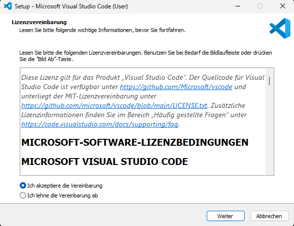

**Zielordner**: den vorgeschlagenen Pfad lassen und auf Next klicken.

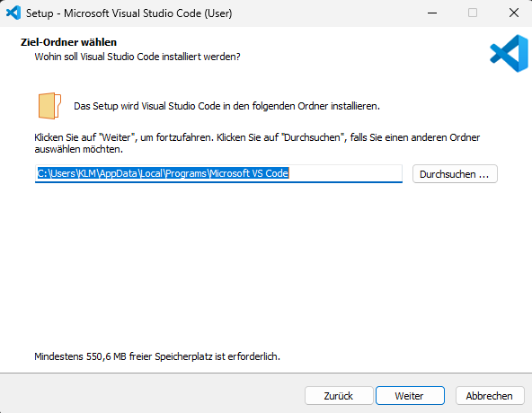

**Startmenü-Ordner**: so lassen und auf Next klicken.

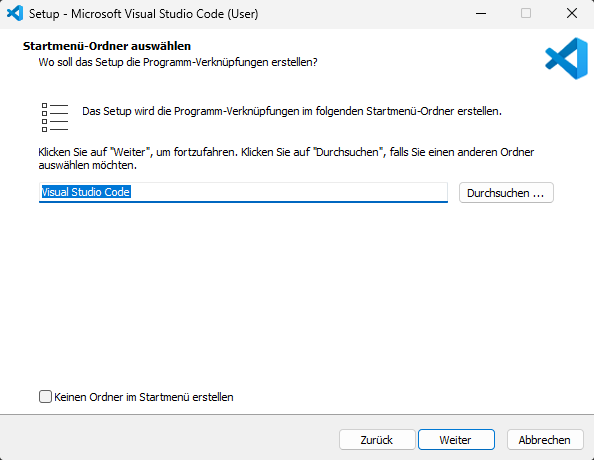

**Zusammenfassung**: durchsehen und auf Install klicken.

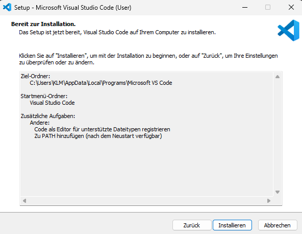

**Fortschritt der Installation**: warten, bis sie fertig ist.

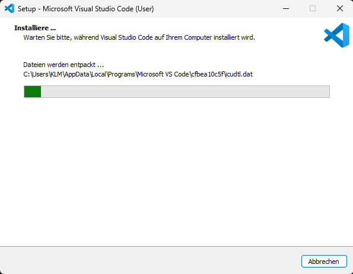
:::

---

## 2 – Quarto installieren

**① Auf der Quarto-Website das Installationsprogramm herunterladen**

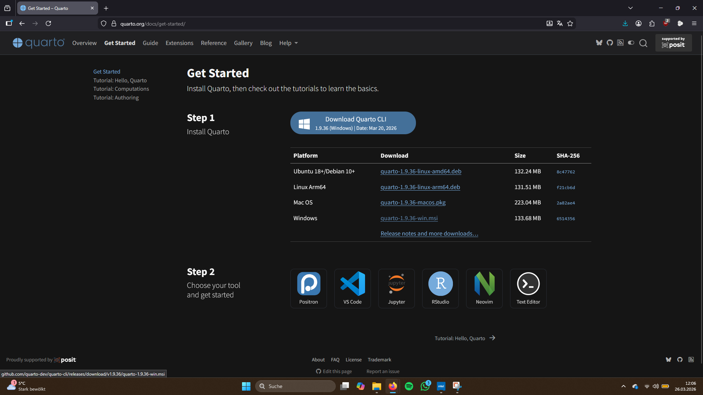

Öffne [quarto.org/docs/get-started](https://quarto.org/docs/get-started/) und klicke unter Step 1 auf **Download Quarto CLI**. Wähle das Installationsprogramm für Windows.

---

**② Quarto-Installation starten**

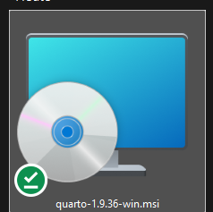

Doppelklicke auf die heruntergeladene `.msi`-Datei. Alle Seiten kannst du mit den Voreinstellungen durchklicken.

---

**③ Fertig**

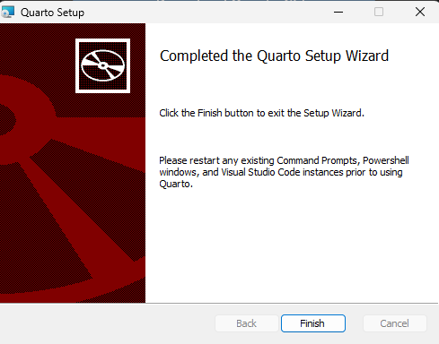

Klicke auf **Finish**. Quarto ist jetzt installiert.

::: {.callout-note collapse="true"}
## 🔍 Im Detail: jede Seite des Quarto-Installationsprogramms

**Willkommensseite**: auf Next klicken.

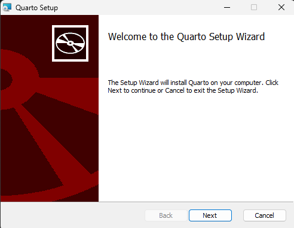

**Umfang der Installation**: „Install just for you“ passt für die meisten.

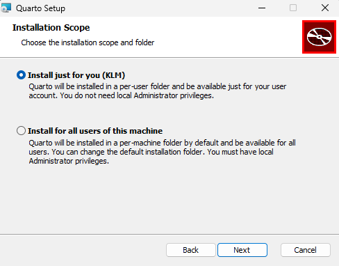

**Zielordner**: den Vorschlag lassen und auf Next klicken.

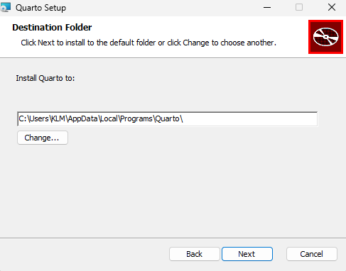

**Fortschritt der Installation**: warten, bis sie fertig ist.

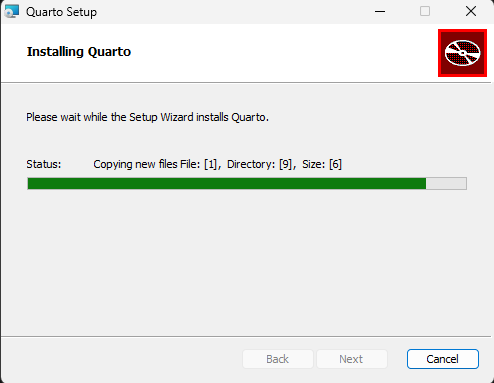
:::

---

## 3 – Die Quarto-Erweiterung in VS Code installieren

**① Erweiterung suchen und installieren**

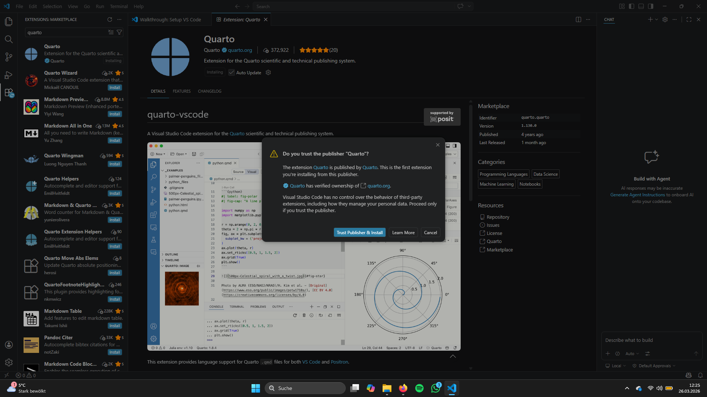

Klicke in VS Code links auf das Symbol **Extensions** (vier Quadrate). Suche nach **Quarto**, klicke auf das Ergebnis und im folgenden Fenster auf **Trust Publisher & Install**.

---

::: {.callout-tip}
## ✅ Geschafft, du kannst loslegen!
Weiter geht es mit [Website erstellen →](beg_website_2.qmd)
:::
::::

:::: {.content-visible when-profile="english"}
::: {.callout-note}
## Official Documentation
Full installation instructions are also available at **[quarto.org/docs/get-started](https://quarto.org/docs/get-started/)**.
:::

::: {.callout-tip}
## Prefer a quick reference?
This chapter as a 4-page [PDF cheatsheet](beg_website_cheatsheet.qmd) — setup, writing content, and publishing, condensed for printing or quick lookup.
:::

You need three things installed. This takes about 10–15 minutes.
The screenshots are the same in all languages (English Windows).

---

## 1 — Install VS Code

**① Go to the VS Code website and download the installer**

Go to [code.visualstudio.com](https://code.visualstudio.com) and click the large **Download for Windows** button. The file will download to your Downloads folder.

---

**② Run the installer**

Double-click the downloaded file (it looks like the VS Code logo with a green checkmark).

---

**③ Make sure "Add to PATH" is checked**

During installation you will see a screen with checkboxes. Make sure **"Add to PATH"** is ticked — this is important for Quarto to work correctly. Then click **Next**.

---

**④ Finish the installation**

Click **Finish**. VS Code will open automatically.

::: {.callout-note collapse="true"}
## 🔍 Detailed: every VS Code installer screen

**License agreement** — select "I accept" and click Next.

**Destination folder** — leave the default path and click Next.

**Start menu folder** — leave as is and click Next.

**Summary screen** — review and click Install.

**Installation progress** — wait for it to complete.

:::

---

## 2 — Install Quarto

**① Go to the Quarto website and download the installer**

Go to [quarto.org/docs/get-started](https://quarto.org/docs/get-started/) and click the **Download Quarto CLI** button under Step 1. Choose the Windows installer.

---

**② Run the Quarto installer**

Double-click the downloaded `.msi` file and follow the installer. You can click through all screens with the default settings.

---

**③ Finish**

Click **Finish**. Quarto is now installed.

::: {.callout-note collapse="true"}
## 🔍 Detailed: every Quarto installer screen

**Welcome screen** — click Next.

**Installation scope** — "Install just for you" is fine for most users.

**Destination folder** — leave the default and click Next.

**Installation progress** — wait for it to complete.

:::

---

## 3 — Install the Quarto Extension in VS Code

**① Search for and install the Quarto extension**

In VS Code, click the **Extensions** icon in the left sidebar (four squares). Search for **Quarto**, click on the result, and click **Trust Publisher & Install** in the dialog that appears.

---

::: {.callout-tip}
## ✅ All done — ready to build!
Continue with [Create a Website →](beg_website_2.qmd)
:::
::::

:::: {.content-visible when-profile="dansk"}
::: {.callout-note}
## Officiel dokumentation
Den fulde installationsvejledning findes også på **[quarto.org/docs/get-started](https://quarto.org/docs/get-started/)**.
:::

::: {.callout-tip}
## Vil du hellere have en kort udgave?
Dette kapitel findes som et [PDF-cheatsheet](beg_website_cheatsheet.qmd) på fire sider: opsætning, at skrive indhold og udgivelse, kort fortalt til udskrift eller hurtigt opslag.
:::

Du skal installere tre ting. Det tager cirka 10–15 minutter.
Skærmbillederne er de samme på alle sprog (engelsk Windows).

---

## 1 – Installer VS Code

**① Gå til VS Codes websted, og hent installationsprogrammet**

Gå til [code.visualstudio.com](https://code.visualstudio.com), og klik på den store knap **Download for Windows**. Filen lander i din mappe med overførsler.

---

**② Start installationsprogrammet**

Dobbeltklik på den hentede fil (den ligner VS Code-logoet med et grønt flueben).

---

**③ Sørg for, at "Add to PATH" er markeret**

Under installationen kommer der en side med afkrydsningsfelter. Sørg for, at **"Add to PATH"** er markeret, det er vigtigt for, at Quarto virker rigtigt. Klik derefter på **Next**.

---

**④ Afslut installationen**

Klik på **Finish**. VS Code åbnes automatisk.

::: {.callout-note collapse="true"}
## 🔍 I detaljer: alle sider i installationsprogrammet til VS Code

**Licensaftale**: vælg "I accept", og klik på Next.

**Destinationsmappe**: behold standardstien, og klik på Next.

**Mappe i startmenuen**: lad den stå, og klik på Next.

**Oversigt**: se den igennem, og klik på Install.

**Installationen er i gang**: vent, til den er færdig.

:::

---

## 2 – Installer Quarto

**① Gå til Quartos websted, og hent installationsprogrammet**

Gå til [quarto.org/docs/get-started](https://quarto.org/docs/get-started/), og klik på knappen **Download Quarto CLI** under Step 1. Vælg installationsprogrammet til Windows.

---

**② Start installationsprogrammet til Quarto**

Dobbeltklik på den hentede `.msi`-fil, og følg installationsprogrammet. Du kan klikke dig igennem alle sider med standardindstillingerne.

---

**③ Afslut**

Klik på **Finish**. Nu er Quarto installeret.

::: {.callout-note collapse="true"}
## 🔍 I detaljer: alle sider i installationsprogrammet til Quarto

**Velkomstside**: klik på Next.

**Installationens omfang**: "Install just for you" er fint for de fleste.

**Destinationsmappe**: behold standardvalget, og klik på Next.

**Installationen er i gang**: vent, til den er færdig.

:::

---

## 3 – Installer Quarto-udvidelsen i VS Code

**① Søg efter Quarto-udvidelsen, og installer den**

Klik i VS Code på symbolet **Extensions** i sidepanelet til venstre (fire firkanter). Søg efter **Quarto**, klik på resultatet, og klik på **Trust Publisher & Install** i den dialogboks, der vises.

---

::: {.callout-tip}
## ✅ Færdig – nu kan du gå i gang med at bygge!
Fortsæt med [Opret et websted →](beg_website_2.qmd)
:::
::::

:::: {.content-visible when-profile="norsk"}
::: {.callout-note}
## Offisiell dokumentasjon
Fullstendige installasjonsanvisninger finnes også på **[quarto.org/docs/get-started](https://quarto.org/docs/get-started/)**.
:::

::: {.callout-tip}
## Vil du heller ha en kortversjon?
Dette kapittelet finnes som et [PDF-cheatsheet](beg_website_cheatsheet.qmd) på fire sider: oppsett, å skrive innhold og publisering, kort oppsummert til utskrift eller raskt oppslag.
:::

Du må installere tre ting. Det tar omtrent 10–15 minutter.
Skjermbildene er de samme på alle språk (engelsk Windows).

---

## 1 – Installer VS Code

**① Gå til nettstedet til VS Code og last ned installasjonsprogrammet**

Gå til [code.visualstudio.com](https://code.visualstudio.com) og klikk på den store knappen **Download for Windows**. Filen havner i nedlastingsmappen din.

---

**② Start installasjonsprogrammet**

Dobbeltklikk på den nedlastede filen (den ser ut som VS Code-logoen med en grønn hake).

---

**③ Pass på at "Add to PATH" er krysset av**

Under installasjonen kommer det en side med avkrysningsbokser. Pass på at **"Add to PATH"** er krysset av, det er viktig for at Quarto skal fungere riktig. Klikk deretter på **Next**.

---

**④ Fullfør installasjonen**

Klikk på **Finish**. VS Code åpnes automatisk.

::: {.callout-note collapse="true"}
## 🔍 I detalj: alle sidene i installasjonsprogrammet for VS Code

**Lisensavtale**: velg "I accept" og klikk på Next.

**Målmappe**: behold standardbanen og klikk på Next.

**Mappe i startmenyen**: la den stå og klikk på Next.

**Oppsummering**: se over og klikk på Install.

**Installasjonen pågår**: vent til den er ferdig.

:::

---

## 2 – Installer Quarto

**① Gå til nettstedet til Quarto og last ned installasjonsprogrammet**

Gå til [quarto.org/docs/get-started](https://quarto.org/docs/get-started/) og klikk på knappen **Download Quarto CLI** under Step 1. Velg installasjonsprogrammet for Windows.

---

**② Start installasjonsprogrammet for Quarto**

Dobbeltklikk på den nedlastede `.msi`-filen og følg installasjonsprogrammet. Du kan klikke deg gjennom alle sidene med standardinnstillingene.

---

**③ Fullfør**

Klikk på **Finish**. Nå er Quarto installert.

::: {.callout-note collapse="true"}
## 🔍 I detalj: alle sidene i installasjonsprogrammet for Quarto

**Velkomstside**: klikk på Next.

**Omfang av installasjonen**: "Install just for you" holder for de fleste.

**Målmappe**: behold standardvalget og klikk på Next.

**Installasjonen pågår**: vent til den er ferdig.

:::

---

## 3 – Installer Quarto-utvidelsen i VS Code

**① Søk etter Quarto-utvidelsen og installer den**

Klikk i VS Code på symbolet **Extensions** i sidefeltet til venstre (fire firkanter). Søk etter **Quarto**, klikk på treffet og klikk på **Trust Publisher & Install** i dialogboksen som kommer opp.

---

::: {.callout-tip}
## ✅ Ferdig – nå kan du begynne å bygge!
Fortsett med [Lag et nettsted →](beg_website_2.qmd)
:::
::::

:::: {.content-visible when-profile="svenska"}
::: {.callout-note}
## Officiell dokumentation
Fullständiga installationsanvisningar finns också på **[quarto.org/docs/get-started](https://quarto.org/docs/get-started/)**.
:::

::: {.callout-tip}
## Vill du hellre ha en kortversion?
Det här kapitlet finns som en [PDF-lathund](beg_website_cheatsheet.qmd) på fyra sidor: installation, att skriva innehåll och publicering, kortfattat för utskrift eller snabb uppslagning.
:::

Du behöver installera tre saker. Det tar ungefär 10–15 minuter.
Skärmbilderna är desamma på alla språk (engelskt Windows).

---

## 1 – Installera VS Code

**① Gå till VS Codes webbplats och ladda ner installationsprogrammet**

Gå till [code.visualstudio.com](https://code.visualstudio.com) och klicka på den stora knappen **Download for Windows**. Filen hamnar i din mapp för nedladdningar.

---

**② Starta installationsprogrammet**

Dubbelklicka på den nedladdade filen (den ser ut som VS Code-logotypen med en grön bock).

---

**③ Se till att "Add to PATH" är ikryssat**

Under installationen visas en sida med kryssrutor. Se till att **"Add to PATH"** är ikryssat, det är viktigt för att Quarto ska fungera som det ska. Klicka sedan på **Next**.

---

**④ Avsluta installationen**

Klicka på **Finish**. VS Code öppnas automatiskt.

::: {.callout-note collapse="true"}
## 🔍 I detalj: alla sidor i installationsprogrammet för VS Code

**Licensavtal**: välj "I accept" och klicka på Next.

**Målmapp**: behåll standardsökvägen och klicka på Next.

**Mapp i startmenyn**: låt den vara och klicka på Next.

**Sammanfattning**: läs igenom och klicka på Install.

**Installationen pågår**: vänta tills den är klar.

:::

---

## 2 – Installera Quarto

**① Gå till Quartos webbplats och ladda ner installationsprogrammet**

Gå till [quarto.org/docs/get-started](https://quarto.org/docs/get-started/) och klicka på knappen **Download Quarto CLI** under Step 1. Välj installationsprogrammet för Windows.

---

**② Starta installationsprogrammet för Quarto**

Dubbelklicka på den nedladdade `.msi`-filen och följ installationsprogrammet. Du kan klicka dig igenom alla sidor med standardinställningarna.

---

**③ Avsluta**

Klicka på **Finish**. Nu är Quarto installerat.

::: {.callout-note collapse="true"}
## 🔍 I detalj: alla sidor i installationsprogrammet för Quarto

**Välkomstsida**: klicka på Next.

**Installationens omfattning**: "Install just for you" räcker för de flesta.

**Målmapp**: behåll standardvärdet och klicka på Next.

**Installationen pågår**: vänta tills den är klar.

:::

---

## 3 – Installera Quarto-tillägget i VS Code

**① Sök efter Quarto-tillägget och installera det**

Klicka i VS Code på symbolen **Extensions** i sidofältet till vänster (fyra rutor). Sök efter **Quarto**, klicka på träffen och klicka på **Trust Publisher & Install** i dialogrutan som visas.

---

::: {.callout-tip}
## ✅ Klart – nu kan du börja bygga!
Fortsätt med [Skapa en webbplats →](beg_website_2.qmd)
:::
::::
