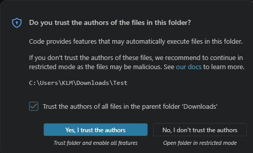
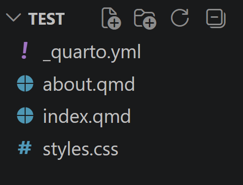
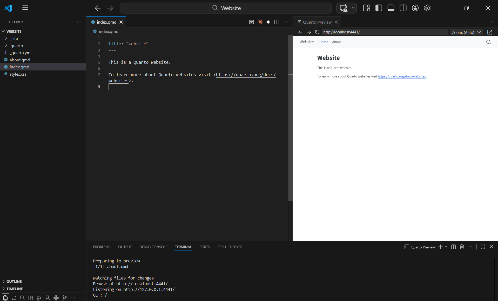
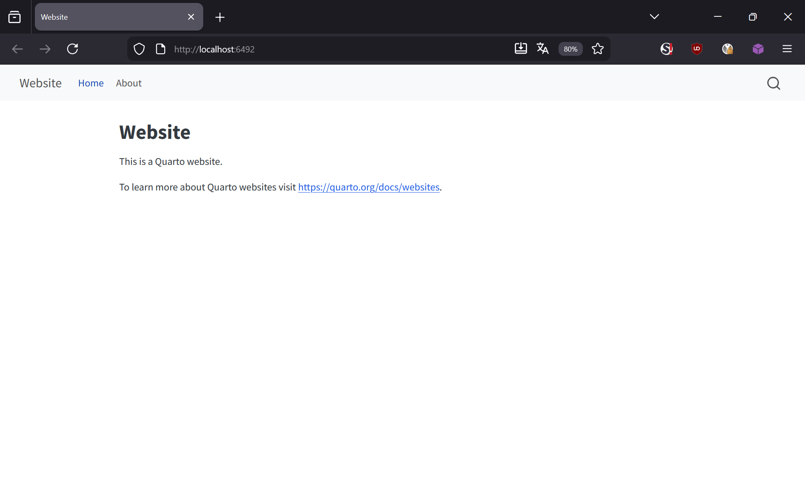

## 1 — Open your project folder in VS Code

Create a new empty folder on your computer (e.g. on the Desktop). Name it something short without spaces, like `my-website`.

In VS Code click **File → Open Folder** and select your new folder.

::: {.callout-warning}
## VS Code will ask: "Do you trust the authors?"



This dialog appears the first time you open any folder. Click **Yes, I trust the authors** — otherwise VS Code runs in a restricted mode and some features will not work.
:::

---

## 2 — Create a Quarto Website project

**① Create a new Quarto project**


Go to **File → New File…**. A small menu appears — select **Quarto Project**.


Select **Website Project** and choose your project folder.

---

**② Your project files are ready**



Quarto created four files:

- `_quarto.yml` — settings: title, navigation, theme
- `index.qmd` — your homepage
- `about.qmd` — an example second page
- `styles.css` — optional custom styling

---

## 3 — Preview your website

**① Click the Preview button in the top-right corner of the editor**



Click the small preview icon in the top-right corner of the coding window. VS Code opens the terminal automatically, renders your site, and shows a live preview in a new panel on the right — no browser needed.

---

::: {.callout-note collapse="true"}
## 🔍 Other ways to preview and render

**Render files (create output without previewing)**

If you just want to produce the output files without opening any preview, open the **Terminal** via **View → Terminal** and run:

```{.bash filename="Terminal"}
quarto render
```

This creates all output files in the `_site` folder (or `docs/` if you configured it that way). Use this when you are ready to publish — see [Publish your Website →](beg_website_3.qmd).

---

**Preview in your browser**

You have two options:

- Open the generated HTML files from the `_site` folder directly in your browser (double-click them in File Explorer).
- Or run `quarto preview` in the Terminal — this starts a local server and opens your site in the browser automatically. The browser updates every time you save a file.

```{.bash filename="Terminal"}
quarto preview
```


:::


---

::: {.callout-tip}
## ✅ Your first Quarto website is running!

**Next steps:**

- Edit `index.qmd` and save — the preview updates immediately
- Change the `title:` in `_quarto.yml` to rename your site
- Ready to go online? Continue with [Publish your Website →](beg_website_3.qmd)
:::
