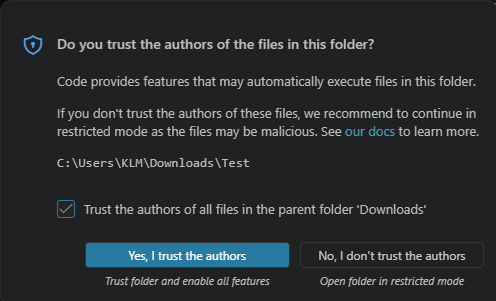
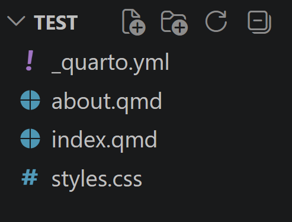
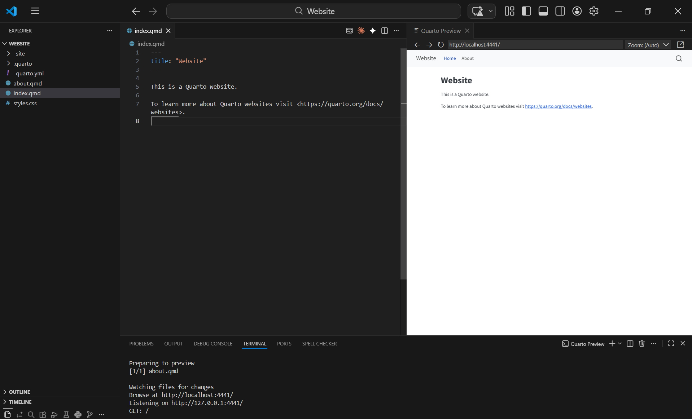
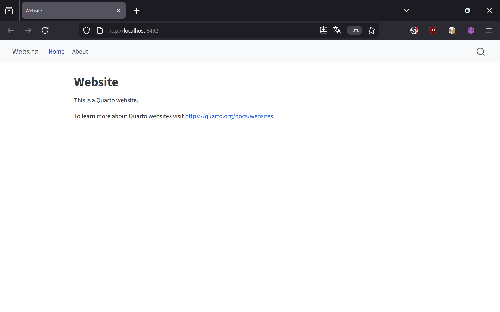

:::: {.content-visible when-profile="deutsch"}
## 1 – Projektordner in VS Code öffnen

Lege auf deinem Rechner einen neuen, leeren Ordner an (zum Beispiel auf dem Desktop). Gib ihm einen kurzen Namen ohne Leerzeichen, etwa `my-website`.

Klicke in VS Code auf **File → Open Folder** und wähle den neuen Ordner aus.

::: {.callout-warning}
## VS Code fragt: „Do you trust the authors?“



Dieses Fenster erscheint, wenn du einen Ordner zum ersten Mal öffnest. Klicke auf **Yes, I trust the authors**, sonst läuft VS Code in einem eingeschränkten Modus und manches funktioniert nicht.
:::

---

## 2 – Ein Quarto-Website-Projekt anlegen

**① Neues Quarto-Projekt anlegen**


Gehe auf **File → New File…**. Es erscheint ein kleines Menü, wähle dort **Quarto Project**.


Wähle **Website Project** und dann deinen Projektordner.

---

**② Deine Projektdateien sind da**



Quarto hat vier Dateien angelegt:

- `_quarto.yml`: Einstellungen wie Titel, Navigation und Aussehen
- `index.qmd`: deine Startseite
- `about.qmd`: eine zweite Seite als Beispiel
- `styles.css`: eigenes Aussehen, wenn du möchtest

---

## 3 – Vorschau der Website

**① Auf den Vorschau-Knopf oben rechts im Editor klicken**



Klicke auf das kleine Vorschau-Symbol oben rechts im Editorfenster. VS Code öffnet von selbst das Terminal, baut deine Seite und zeigt rechts eine Vorschau, die sich laufend aktualisiert. Einen Browser brauchst du dafür nicht.

---

::: {.callout-note collapse="true"}
## 🔍 Andere Wege zu Vorschau und fertigen Dateien

**Dateien bauen (Ausgabe erzeugen, ohne Vorschau)**

Wenn du nur die fertigen Dateien haben möchtest, öffne das **Terminal** über **View → Terminal** und gib ein:

```{.bash filename="Terminal"}
quarto render
```

Damit entstehen alle Ausgabedateien im Ordner `_site` (oder in `docs/`, wenn du das so eingestellt hast). Das brauchst du, wenn du veröffentlichen willst, siehe [Website veröffentlichen →](beg_website_3.qmd).

---

**Vorschau im Browser**

Du hast zwei Möglichkeiten:

- Öffne die erzeugten HTML-Dateien aus dem Ordner `_site` direkt im Browser (Doppelklick im Datei-Explorer).
- Oder gib im Terminal `quarto preview` ein. Das startet einen lokalen Server und öffnet deine Seite im Browser. Bei jedem Speichern aktualisiert sie sich.

```{.bash filename="Terminal"}
quarto preview
```


:::


---

::: {.callout-tip}
## ✅ Deine erste Quarto-Website läuft!

**Wie es weitergeht:**

- Ändere `index.qmd` und speichere, die Vorschau zeigt es sofort
- Ändere `title:` in `_quarto.yml`, um deine Seite umzubenennen
- Bereit für das Internet? Weiter mit [Website veröffentlichen →](beg_website_3.qmd)
:::
::::

:::: {.content-visible when-profile="english"}
## 1 — Open your project folder in VS Code

Create a new empty folder on your computer (e.g. on the Desktop). Name it something short without spaces, like `my-website`.

In VS Code click **File → Open Folder** and select your new folder.

::: {.callout-warning}
## VS Code will ask: "Do you trust the authors?"


This dialog appears the first time you open any folder. Click **Yes, I trust the authors** — otherwise VS Code runs in a restricted mode and some features will not work.
:::

---

## 2 — Create a Quarto Website project

**① Create a new Quarto project**


Go to **File → New File…**. A small menu appears — select **Quarto Project**.


Select **Website Project** and choose your project folder.

---

**② Your project files are ready**


Quarto created four files:

- `_quarto.yml` — settings: title, navigation, theme
- `index.qmd` — your homepage
- `about.qmd` — an example second page
- `styles.css` — optional custom styling

---

## 3 — Preview your website

**① Click the Preview button in the top-right corner of the editor**


Click the small preview icon in the top-right corner of the coding window. VS Code opens the terminal automatically, renders your site, and shows a live preview in a new panel on the right — no browser needed.

---

::: {.callout-note collapse="true"}
## 🔍 Other ways to preview and render

**Render files (create output without previewing)**

If you just want to produce the output files without opening any preview, open the **Terminal** via **View → Terminal** and run:

```{.bash filename="Terminal"}
quarto render
```

This creates all output files in the `_site` folder (or `docs/` if you configured it that way). Use this when you are ready to publish — see [Publish your Website →](beg_website_3.qmd).

---

**Preview in your browser**

You have two options:

- Open the generated HTML files from the `_site` folder directly in your browser (double-click them in File Explorer).
- Or run `quarto preview` in the Terminal — this starts a local server and opens your site in the browser automatically. The browser updates every time you save a file.

```{.bash filename="Terminal"}
quarto preview
```


:::


---

::: {.callout-tip}
## ✅ Your first Quarto website is running!

**Next steps:**

- Edit `index.qmd` and save — the preview updates immediately
- Change the `title:` in `_quarto.yml` to rename your site
- Ready to go online? Continue with [Publish your Website →](beg_website_3.qmd)
:::
::::

:::: {.content-visible when-profile="dansk"}
## 1 – Åbn projektmappen i VS Code

Opret en ny tom mappe på din computer (for eksempel på skrivebordet). Giv den et kort navn uden mellemrum, for eksempel `mit-websted`.

Klik i VS Code på **File → Open Folder**, og vælg den nye mappe.

::: {.callout-warning}
## VS Code spørger: "Do you trust the authors?"


Denne dialogboks vises, første gang du åbner en mappe. Klik på **Yes, I trust the authors**, ellers kører VS Code i en begrænset tilstand, hvor nogle funktioner ikke virker.
:::

---

## 2 – Opret et Quarto-webstedsprojekt

**① Opret et nyt Quarto-projekt**


Gå til **File → New File…**. Der vises en lille menu, vælg **Quarto Project**.


Vælg **Website Project** og derefter din projektmappe.

---

**② Dine projektfiler er klar**


Quarto har oprettet fire filer:

- `_quarto.yml`: indstillinger som titel, navigation og tema
- `index.qmd`: din startside
- `about.qmd`: en side nummer to som eksempel
- `styles.css`: dit eget design, hvis du vil

---

## 3 – Se en forhåndsvisning af webstedet

**① Klik på knappen Preview øverst til højre i editoren**


Klik på det lille forhåndsvisningssymbol øverst til højre i kodevinduet. VS Code åbner terminalen automatisk, renderer webstedet og viser en forhåndsvisning i et nyt panel til højre. Du behøver ingen browser.

---

::: {.callout-note collapse="true"}
## 🔍 Andre måder at forhåndsvise og rendere på

**Rendere filer (lave output uden forhåndsvisning)**

Hvis du kun vil lave outputfilerne uden at åbne en forhåndsvisning, så åbn **terminalen** via **View → Terminal**, og kør:

```{.bash filename="Terminal"}
quarto render
```

Så oprettes alle outputfiler i mappen `_site` (eller `docs/`, hvis du har indstillet det). Brug det, når du er klar til at udgive, se [Udgiv webstedet →](beg_website_3.qmd).

---

**Forhåndsvisning i browseren**

Du har to muligheder:

- Åbn de færdige HTML-filer i mappen `_site` direkte i browseren (dobbeltklik på dem i Stifinder).
- Eller kør `quarto preview` i terminalen. Så startes en lokal server, og webstedet åbnes automatisk i browseren. Browseren opdateres, hver gang du gemmer en fil.

```{.bash filename="Terminal"}
quarto preview
```


:::

---

::: {.callout-tip}
## ✅ Dit første Quarto-websted kører!

**Næste trin:**

- Ret i `index.qmd`, og gem, så opdateres forhåndsvisningen med det samme
- Ret `title:` i `_quarto.yml` for at give webstedet et nyt navn
- Klar til at lægge det på nettet? Fortsæt med [Udgiv webstedet →](beg_website_3.qmd)
:::
::::

:::: {.content-visible when-profile="norsk"}
## 1 – Åpne prosjektmappen i VS Code

Lag en ny tom mappe på datamaskinen (for eksempel på skrivebordet). Gi den et kort navn uten mellomrom, for eksempel `mitt-nettsted`.

Klikk i VS Code på **File → Open Folder** og velg den nye mappen.

::: {.callout-warning}
## VS Code spør: "Do you trust the authors?"


Denne dialogboksen kommer første gang du åpner en mappe. Klikk på **Yes, I trust the authors**, ellers kjører VS Code i en begrenset modus der noen funksjoner ikke virker.
:::

---

## 2 – Lag et Quarto-nettstedsprosjekt

**① Lag et nytt Quarto-prosjekt**


Gå til **File → New File…**. Det kommer en liten meny, velg **Quarto Project**.


Velg **Website Project** og deretter prosjektmappen din.

---

**② Prosjektfilene dine er klare**


Quarto har laget fire filer:

- `_quarto.yml`: innstillinger som tittel, navigasjon og tema
- `index.qmd`: startsiden din
- `about.qmd`: en side nummer to som eksempel
- `styles.css`: egen utforming, hvis du vil

---

## 3 – Forhåndsvis nettstedet

**① Klikk på knappen Preview øverst til høyre i redigeringsvinduet**


Klikk på det lille forhåndsvisningssymbolet øverst til høyre i kodevinduet. VS Code åpner terminalen automatisk, rendrer nettstedet og viser en forhåndsvisning i et nytt panel til høyre. Du trenger ingen nettleser.

---

::: {.callout-note collapse="true"}
## 🔍 Andre måter å forhåndsvise og rendre på

**Rendre filer (lage utdata uten forhåndsvisning)**

Hvis du bare vil lage utdatafilene uten å åpne noen forhåndsvisning, åpner du **terminalen** via **View → Terminal** og kjører:

```{.bash filename="Terminal"}
quarto render
```

Da lages alle utdatafilene i mappen `_site` (eller `docs/` hvis du har satt det opp slik). Bruk dette når du er klar til å publisere, se [Publiser nettstedet →](beg_website_3.qmd).

---

**Forhåndsvis i nettleseren**

Du har to muligheter:

- Åpne de ferdige HTML-filene i mappen `_site` direkte i nettleseren (dobbeltklikk på dem i Filutforsker).
- Eller kjør `quarto preview` i terminalen. Da startes en lokal server, og nettstedet åpnes automatisk i nettleseren. Nettleseren oppdateres hver gang du lagrer en fil.

```{.bash filename="Terminal"}
quarto preview
```


:::

---

::: {.callout-tip}
## ✅ Ditt første Quarto-nettsted kjører!

**Neste trinn:**

- Endre `index.qmd` og lagre, så oppdateres forhåndsvisningen med en gang
- Endre `title:` i `_quarto.yml` for å gi nettstedet et nytt navn
- Klar til å legge det ut på nett? Fortsett med [Publiser nettstedet →](beg_website_3.qmd)
:::
::::

:::: {.content-visible when-profile="svenska"}
## 1 – Öppna projektmappen i VS Code

Skapa en ny tom mapp på datorn (till exempel på skrivbordet). Ge den ett kort namn utan mellanslag, till exempel `min-webbplats`.

Klicka i VS Code på **File → Open Folder** och välj den nya mappen.

::: {.callout-warning}
## VS Code frågar: "Do you trust the authors?"


Den här dialogrutan visas första gången du öppnar en mapp. Klicka på **Yes, I trust the authors**, annars körs VS Code i ett begränsat läge där vissa funktioner inte fungerar.
:::

---

## 2 – Skapa ett Quarto-webbplatsprojekt

**① Skapa ett nytt Quarto-projekt**


Gå till **File → New File…**. En liten meny visas, välj **Quarto Project**.


Välj **Website Project** och sedan din projektmapp.

---

**② Dina projektfiler är klara**


Quarto har skapat fyra filer:

- `_quarto.yml`: inställningar som titel, navigering och tema
- `index.qmd`: din startsida
- `about.qmd`: en andra sida som exempel
- `styles.css`: egen formgivning, om du vill

---

## 3 – Förhandsgranska webbplatsen

**① Klicka på knappen Preview uppe till höger i redigeraren**


Klicka på den lilla förhandsgranskningssymbolen uppe till höger i kodfönstret. VS Code öppnar terminalen automatiskt, renderar webbplatsen och visar en förhandsgranskning i en ny panel till höger. Du behöver ingen webbläsare.

---

::: {.callout-note collapse="true"}
## 🔍 Andra sätt att förhandsgranska och rendera

**Rendera filer (skapa utdata utan förhandsgranskning)**

Om du bara vill skapa utdatafilerna utan att öppna någon förhandsgranskning, öppna **terminalen** via **View → Terminal** och kör:

```{.bash filename="Terminal"}
quarto render
```

Då skapas alla utdatafiler i mappen `_site` (eller `docs/` om du har ställt in det). Använd det här när du är redo att publicera, se [Publicera webbplatsen →](beg_website_3.qmd).

---

**Förhandsgranska i webbläsaren**

Du har två möjligheter:

- Öppna de skapade HTML-filerna i mappen `_site` direkt i webbläsaren (dubbelklicka på dem i Utforskaren).
- Eller kör `quarto preview` i terminalen. Då startas en lokal server och webbplatsen öppnas automatiskt i webbläsaren. Webbläsaren uppdateras varje gång du sparar en fil.

```{.bash filename="Terminal"}
quarto preview
```


:::

---

::: {.callout-tip}
## ✅ Din första Quarto-webbplats är igång!

**Nästa steg:**

- Ändra i `index.qmd` och spara, så uppdateras förhandsgranskningen direkt
- Ändra `title:` i `_quarto.yml` för att byta namn på webbplatsen
- Redo att lägga ut den på nätet? Fortsätt med [Publicera webbplatsen →](beg_website_3.qmd)
:::
::::
