::: {.callout-note}
## Official Documentation
Quarto supports several publishing options. See all of them at **[quarto.org/docs/publishing](https://quarto.org/docs/publishing/)**.
:::

This guide uses **GitHub Pages** — a free hosting service that makes your website publicly available at a `github.io` address.

You will need a free account at [github.com](https://github.com). Create one if you don't have one yet.

---

## 1 — Tell Quarto to output into a `docs` folder

**① Open `_quarto.yml` and add the output folder**

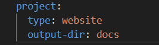

Open your `_quarto.yml` file and add `output-dir: docs` to the `project:` section, exactly as shown above. GitHub Pages expects your website files to live in a folder named `docs`.

---

**② Render your website**

Open the **Terminal** via **View → Terminal** and run:

```{.bash filename="Terminal"}
quarto render
```

Quarto builds your entire website into the `docs/` folder. You will see it appear in the file explorer on the left.

---

## 2 — Create a repository on GitHub

**① Go to GitHub and create a new repository**

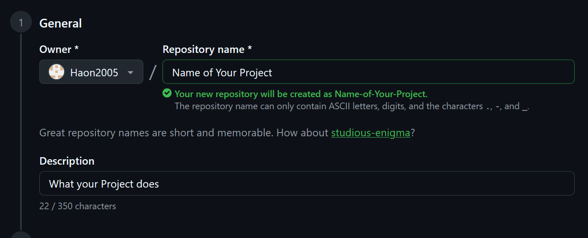

Log in at [github.com](https://github.com), click the **+** icon in the top right and select **New repository**. Give it a name — this will become part of your website's address.

---

**② Set it to Public and create**

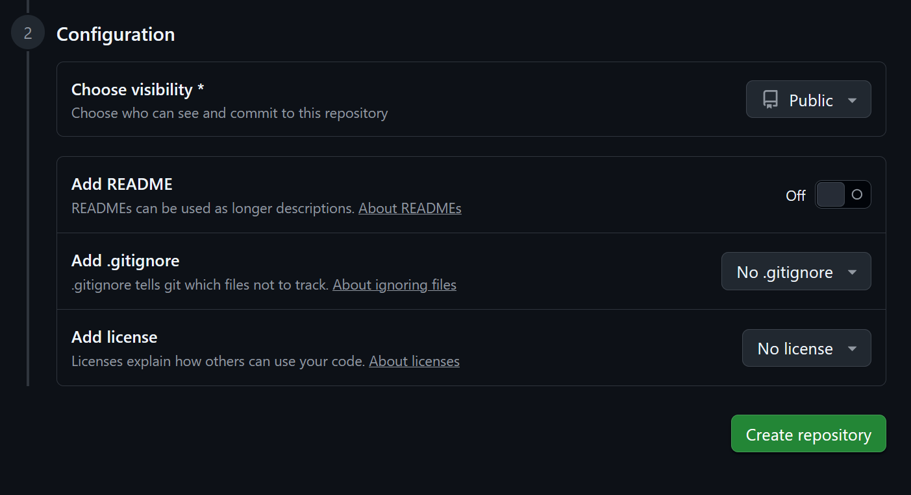

Make sure **Public** is selected. Leave all other options at their defaults and click **Create repository**.

---

## 3 — Upload your files

**① Find the upload link**

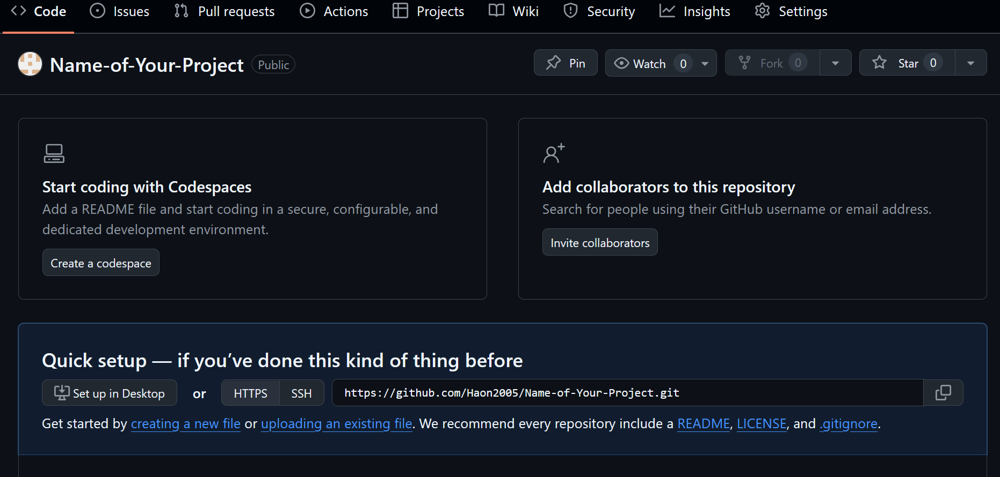

Your new empty repository opens. Click **uploading an existing file** in the middle of the page.

---

**② Drag your project files onto the page**

Drag all files and folders from your project folder directly onto the GitHub upload page. Include everything: `docs/`, `_quarto.yml`, `index.qmd`, `styles.css`, and any other files.

::: {.callout-warning}
Do **not** upload just the `docs/` folder contents — upload the entire project folder's contents so GitHub has everything it needs.
:::

GitHub will show a **"Processing your files..."** spinner while uploading.

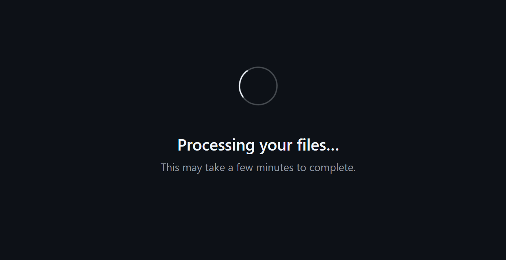

---

**③ Commit the files**

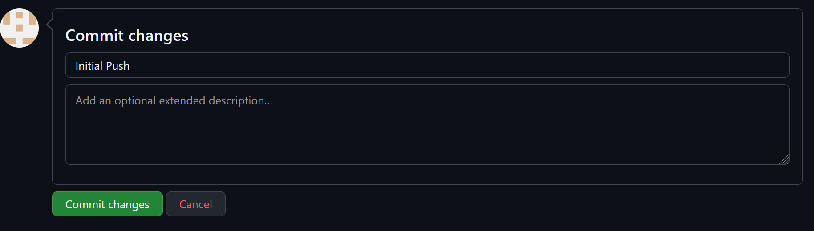

After uploading, scroll down. You will see a **"Commit changes"** dialog. You can leave the message as "Initial Push" or write your own. Click **Commit changes**.

---

## 4 — Enable GitHub Pages

**① Open the repository Settings**


Click the **Settings** tab at the top of your repository page.

---

**② Find "Pages" in the left sidebar**

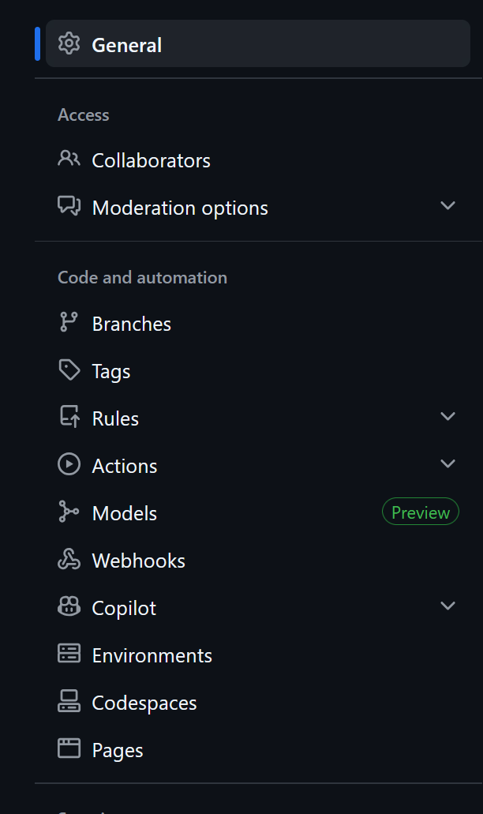

Scroll down the left sidebar and click **Pages**.

---

**③ Select branch `main` and folder `/docs`**

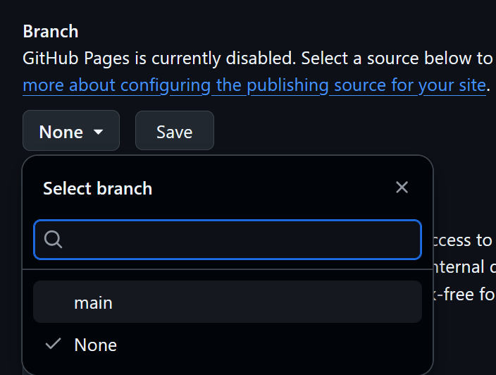

Under **Branch**, click the dropdown that says **None** and select **main**.

---

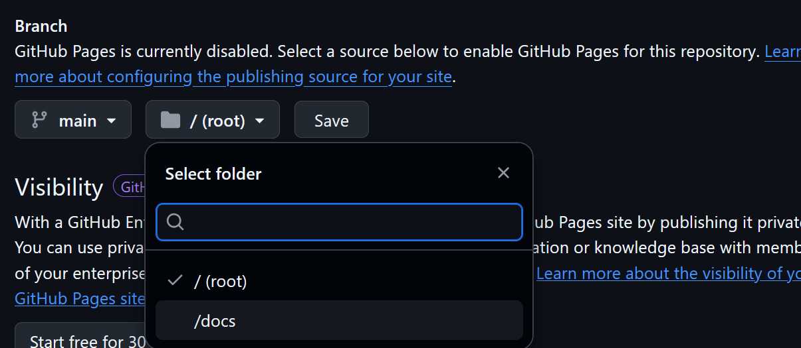

A second dropdown appears for the folder. Click it and select **/docs**.

---

**④ Save**

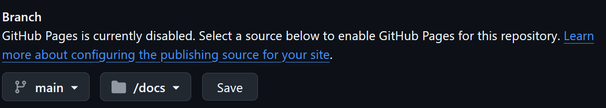

Click **Save**. GitHub will now start building and deploying your site.

---

## 5 — Your site is live

**① Wait for deployment**

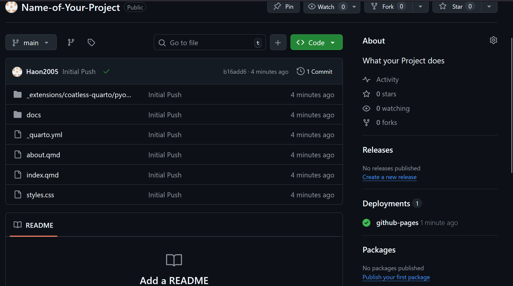

Go back to the main page of your repository. On the right side you will see a **Deployments** section. Wait until it shows a green checkmark — this usually takes 1–2 minutes.

Click on the deployment to find your public website address — it looks like `https://yourusername.github.io/your-repo-name/`.

---

::: {.callout-tip}
## Updating your site later

Whenever you make changes:

1. Run `quarto render` in VS Code's Terminal (or click the Preview button and close it) to rebuild the `docs/` folder
2. Go to your GitHub repository → drag the updated `docs/` folder onto the file list → Commit

GitHub Pages will redeploy automatically within a minute or two.
:::
