:::: {.content-visible when-profile="deutsch"}
::: {.callout-note}
## Offizielle Dokumentation
Quarto kennt mehrere Wege zum Veröffentlichen. Alle stehen unter **[quarto.org/docs/publishing](https://quarto.org/docs/publishing/)**.
:::

Diese Anleitung nutzt **GitHub Pages**, einen kostenlosen Dienst, der deine Website unter einer `github.io`-Adresse öffentlich erreichbar macht.

Du brauchst ein kostenloses Konto bei [github.com](https://github.com). Lege eins an, falls du noch keins hast.

---

## 1 – Quarto in einen Ordner `docs` schreiben lassen

**① `_quarto.yml` öffnen und den Ausgabeordner eintragen**

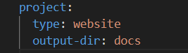

Öffne deine `_quarto.yml` und ergänze im Abschnitt `project:` die Zeile `output-dir: docs`, genau wie im Bild. GitHub Pages erwartet die Dateien der Website in einem Ordner namens `docs`.

---

**② Website bauen**

Öffne das **Terminal** über **View → Terminal** und gib ein:

```{.bash filename="Terminal"}
quarto render
```

Quarto baut die ganze Website in den Ordner `docs/`. Er erscheint links in der Dateiübersicht.

---

## 2 – Ein Repository auf GitHub anlegen

**① Auf GitHub ein neues Repository anlegen**

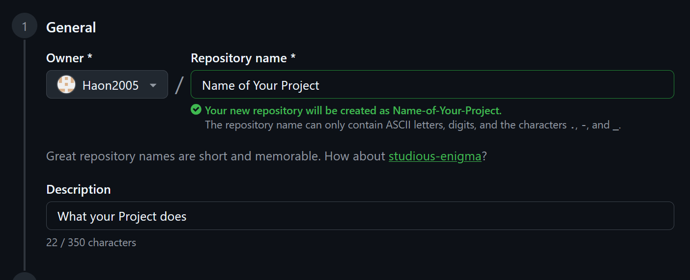

Melde dich bei [github.com](https://github.com) an, klicke oben rechts auf das **+** und wähle **New repository**. Gib ihm einen Namen, er wird Teil der Adresse deiner Website.

---

**② Auf Public stellen und anlegen**

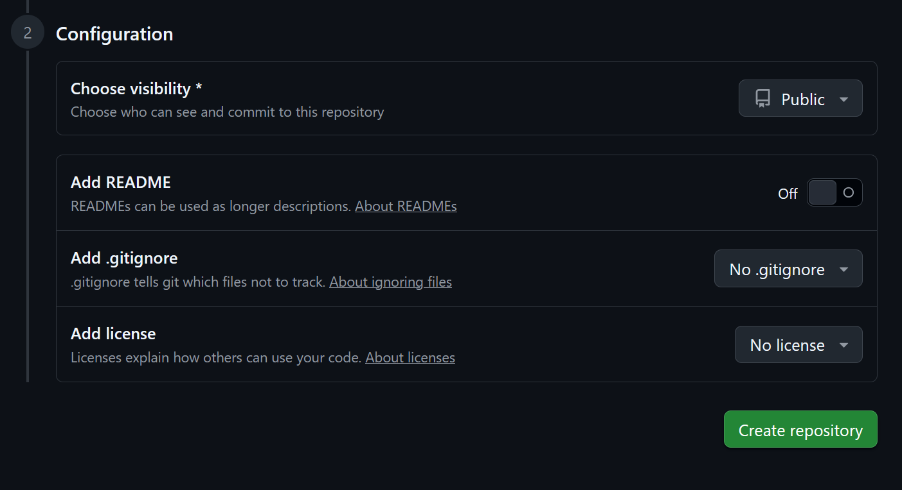

Achte darauf, dass **Public** ausgewählt ist. Alles andere bleibt, wie es ist. Klicke auf **Create repository**.

---

## 3 – Dateien hochladen

**① Den Link zum Hochladen finden**

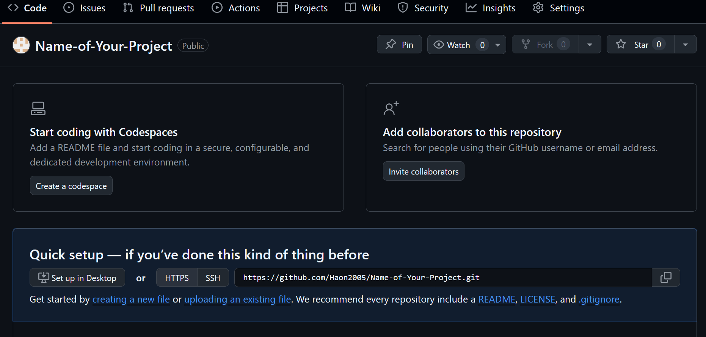

Dein neues, leeres Repository öffnet sich. Klicke in der Mitte der Seite auf **uploading an existing file**.

---

**② Projektdateien auf die Seite ziehen**

Ziehe alle Dateien und Ordner aus deinem Projektordner direkt auf die Upload-Seite von GitHub. Nimm alles mit: `docs/`, `_quarto.yml`, `index.qmd`, `styles.css` und alle weiteren Dateien.

::: {.callout-warning}
Lade **nicht** nur den Inhalt von `docs/` hoch, sondern den Inhalt des ganzen Projektordners, damit GitHub alles hat, was es braucht.
:::

Während des Hochladens zeigt GitHub **„Processing your files...“** an.

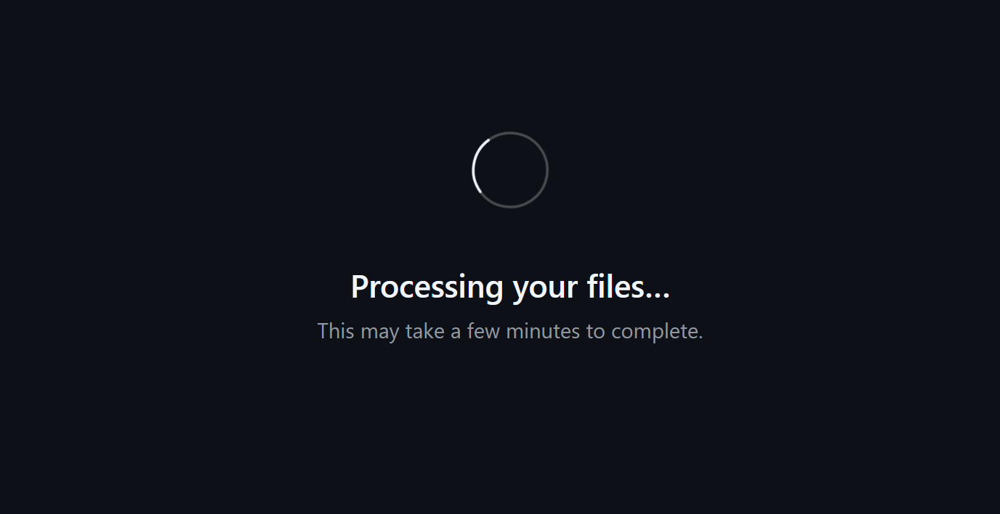

---

**③ Dateien committen**

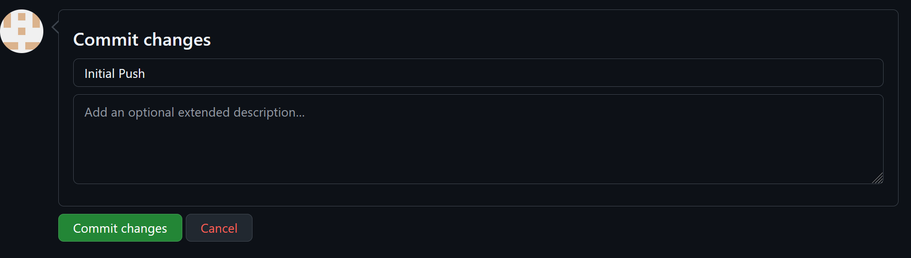

Scrolle nach dem Hochladen nach unten. Dort steht das Feld **„Commit changes“**. Du kannst die Nachricht „Initial Push“ lassen oder eine eigene schreiben. Klicke auf **Commit changes**.

---

## 4 – GitHub Pages einschalten

**① Die Einstellungen des Repositorys öffnen**


Klicke oben auf der Seite deines Repositorys auf den Reiter **Settings**.

---

**② In der linken Leiste „Pages“ suchen**

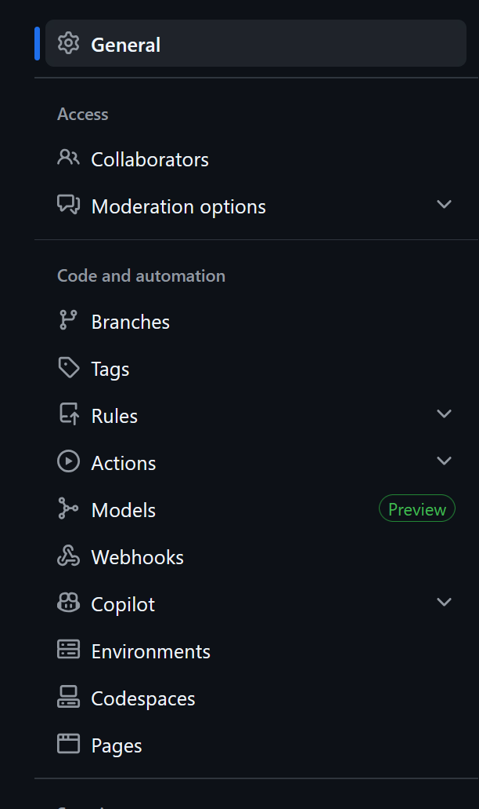

Scrolle in der linken Leiste nach unten und klicke auf **Pages**.

---

**③ Branch `main` und Ordner `/docs` auswählen**

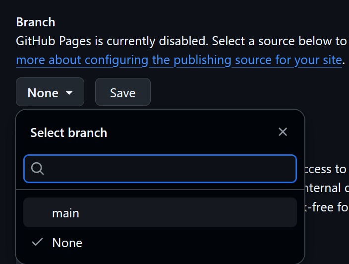

Klicke unter **Branch** auf das Auswahlfeld, in dem **None** steht, und wähle **main**.

---

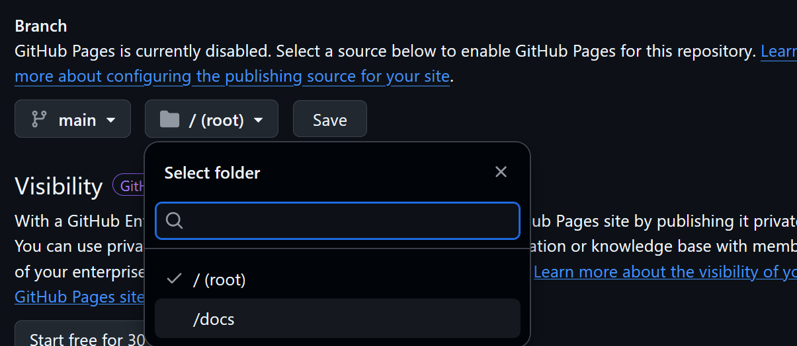

Daneben erscheint ein zweites Auswahlfeld für den Ordner. Klicke darauf und wähle **/docs**.

---

**④ Speichern**

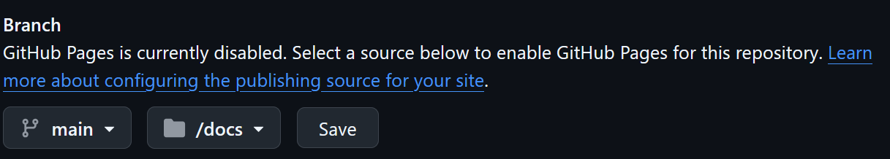

Klicke auf **Save**. GitHub beginnt jetzt, deine Seite zu bauen und bereitzustellen.

---

## 5 – Deine Seite ist online

**① Auf die Bereitstellung warten**

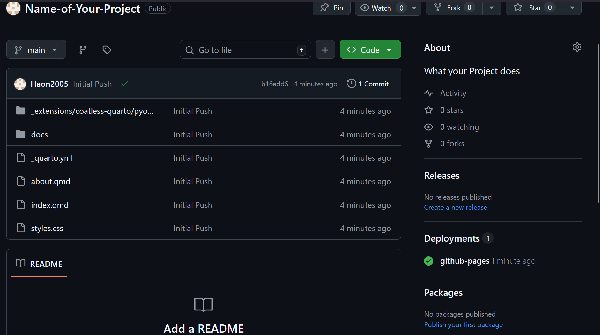

Geh zurück auf die Hauptseite deines Repositorys. Rechts steht der Abschnitt **Deployments**. Warte, bis dort ein grüner Haken erscheint, das dauert meist 1–2 Minuten.

Klicke auf die Bereitstellung, dort steht die öffentliche Adresse deiner Website. Sie sieht aus wie `https://deinname.github.io/dein-repo-name/`.

---

::: {.callout-tip}
## Die Seite später aktualisieren

Immer wenn du etwas geändert hast:

1. Gib im Terminal von VS Code `quarto render` ein (oder klicke auf den Vorschau-Knopf und schließe die Vorschau wieder), damit der Ordner `docs/` neu gebaut wird
2. Öffne dein Repository auf GitHub → ziehe den aktualisierten Ordner `docs/` auf die Dateiliste → Commit

GitHub Pages stellt die Seite innerhalb von ein bis zwei Minuten von selbst neu bereit.
:::
::::

:::: {.content-visible when-profile="english"}
::: {.callout-note}
## Official Documentation
Quarto supports several publishing options. See all of them at **[quarto.org/docs/publishing](https://quarto.org/docs/publishing/)**.
:::

This guide uses **GitHub Pages** — a free hosting service that makes your website publicly available at a `github.io` address.

You will need a free account at [github.com](https://github.com). Create one if you don't have one yet.

---

## 1 — Tell Quarto to output into a `docs` folder

**① Open `_quarto.yml` and add the output folder**


Open your `_quarto.yml` file and add `output-dir: docs` to the `project:` section, exactly as shown above. GitHub Pages expects your website files to live in a folder named `docs`.

---

**② Render your website**

Open the **Terminal** via **View → Terminal** and run:

```{.bash filename="Terminal"}
quarto render
```

Quarto builds your entire website into the `docs/` folder. You will see it appear in the file explorer on the left.

---

## 2 — Create a repository on GitHub

**① Go to GitHub and create a new repository**


Log in at [github.com](https://github.com), click the **+** icon in the top right and select **New repository**. Give it a name — this will become part of your website's address.

---

**② Set it to Public and create**


Make sure **Public** is selected. Leave all other options at their defaults and click **Create repository**.

---

## 3 — Upload your files

**① Find the upload link**


Your new empty repository opens. Click **uploading an existing file** in the middle of the page.

---

**② Drag your project files onto the page**

Drag all files and folders from your project folder directly onto the GitHub upload page. Include everything: `docs/`, `_quarto.yml`, `index.qmd`, `styles.css`, and any other files.

::: {.callout-warning}
Do **not** upload just the `docs/` folder contents — upload the entire project folder's contents so GitHub has everything it needs.
:::

GitHub will show a **"Processing your files..."** spinner while uploading.


---

**③ Commit the files**


After uploading, scroll down. You will see a **"Commit changes"** dialog. You can leave the message as "Initial Push" or write your own. Click **Commit changes**.

---

## 4 — Enable GitHub Pages

**① Open the repository Settings**


Click the **Settings** tab at the top of your repository page.

---

**② Find "Pages" in the left sidebar**


Scroll down the left sidebar and click **Pages**.

---

**③ Select branch `main` and folder `/docs`**


Under **Branch**, click the dropdown that says **None** and select **main**.

---


A second dropdown appears for the folder. Click it and select **/docs**.

---

**④ Save**


Click **Save**. GitHub will now start building and deploying your site.

---

## 5 — Your site is live

**① Wait for deployment**


Go back to the main page of your repository. On the right side you will see a **Deployments** section. Wait until it shows a green checkmark — this usually takes 1–2 minutes.

Click on the deployment to find your public website address — it looks like `https://yourusername.github.io/your-repo-name/`.

---

::: {.callout-tip}
## Updating your site later

Whenever you make changes:

1. Run `quarto render` in VS Code's Terminal (or click the Preview button and close it) to rebuild the `docs/` folder
2. Go to your GitHub repository → drag the updated `docs/` folder onto the file list → Commit

GitHub Pages will redeploy automatically within a minute or two.
:::
::::

:::: {.content-visible when-profile="dansk"}
::: {.callout-note}
## Officiel dokumentation
Quarto har flere måder at udgive på. De er alle beskrevet på **[quarto.org/docs/publishing](https://quarto.org/docs/publishing/)**.
:::

Denne guide bruger **GitHub Pages**, en gratis tjeneste, der gør dit websted offentligt tilgængeligt på en `github.io`-adresse.

Du skal bruge en gratis konto på [github.com](https://github.com). Opret en, hvis du ikke har en i forvejen.

---

## 1 – Lad Quarto skrive til en mappe `docs`

**① Åbn `_quarto.yml`, og tilføj outputmappen**


Åbn filen `_quarto.yml`, og tilføj `output-dir: docs` i afsnittet `project:`, præcis som på billedet. GitHub Pages forventer, at webstedets filer ligger i en mappe, der hedder `docs`.

---

**② Render webstedet**

Åbn **terminalen** via **View → Terminal**, og kør:

```{.bash filename="Terminal"}
quarto render
```

Quarto bygger hele webstedet i mappen `docs/`. Du kan se den dukke op i filoversigten til venstre.

---

## 2 – Opret et repository på GitHub

**① Gå til GitHub, og opret et nyt repository**


Log ind på [github.com](https://github.com), klik på **+** øverst til højre, og vælg **New repository**. Giv det et navn, det bliver en del af webstedets adresse.

---

**② Vælg Public, og opret**


Sørg for, at **Public** er valgt. Lad alle andre indstillinger stå, og klik på **Create repository**.

---

## 3 – Upload dine filer

**① Find uploadlinket**


Dit nye, tomme repository åbnes. Klik på **uploading an existing file** midt på siden.

---

**② Træk projektfilerne over på siden**

Træk alle filer og mapper fra projektmappen direkte over på GitHubs uploadside. Tag det hele med: `docs/`, `_quarto.yml`, `index.qmd`, `styles.css` og alle andre filer.

::: {.callout-warning}
Upload **ikke** kun indholdet af mappen `docs/`. Upload indholdet af hele projektmappen, så GitHub har alt, hvad der skal bruges.
:::

GitHub viser **"Processing your files..."**, mens uploaden er i gang.


---

**③ Lav et commit af filerne**


Rul ned efter uploaden. Der finder du dialogen **"Commit changes"**. Du kan lade beskeden stå som "Initial Push" eller skrive din egen. Klik på **Commit changes**.

---

## 4 – Slå GitHub Pages til

**① Åbn Settings for repositoryet**


Klik på fanen **Settings** øverst på repositoryets side.

---

**② Find "Pages" i sidepanelet til venstre**


Rul ned i sidepanelet til venstre, og klik på **Pages**.

---

**③ Vælg branchen `main` og mappen `/docs`**


Klik under **Branch** på listen, hvor der står **None**, og vælg **main**.

---


Der vises endnu en liste til mappen. Klik på den, og vælg **/docs**.

---

**④ Gem**


Klik på **Save**. GitHub begynder nu at bygge og udgive webstedet.

---

## 5 – Webstedet er udgivet

**① Vent på udgivelsen**


Gå tilbage til repositoryets forside. I højre side ser du afsnittet **Deployments**. Vent, til det viser et grønt flueben, det tager som regel 1–2 minutter.

Klik på udgivelsen for at finde webstedets offentlige adresse. Den ser ud som `https://ditbrugernavn.github.io/dit-repo-navn/`.

---

::: {.callout-tip}
## Opdater webstedet senere

Hver gang du har ændret noget:

1. Kør `quarto render` i terminalen i VS Code (eller klik på knappen Preview, og luk den) for at bygge mappen `docs/` igen
2. Gå til dit repository på GitHub → træk den opdaterede mappe `docs/` over på fillisten → Commit

GitHub Pages udgiver automatisk igen inden for et minut eller to.
:::
::::

:::: {.content-visible when-profile="norsk"}
::: {.callout-note}
## Offisiell dokumentasjon
Quarto har flere måter å publisere på. Alle er beskrevet på **[quarto.org/docs/publishing](https://quarto.org/docs/publishing/)**.
:::

Denne guiden bruker **GitHub Pages**, en gratis tjeneste som gjør nettstedet ditt offentlig tilgjengelig på en `github.io`-adresse.

Du trenger en gratis konto på [github.com](https://github.com). Opprett en hvis du ikke har en fra før.

---

## 1 – La Quarto skrive til en mappe `docs`

**① Åpne `_quarto.yml` og legg til utdatamappen**


Åpne filen `_quarto.yml` og legg til `output-dir: docs` i delen `project:`, akkurat som på bildet. GitHub Pages forventer at filene til nettstedet ligger i en mappe som heter `docs`.

---

**② Rendre nettstedet**

Åpne **terminalen** via **View → Terminal** og kjør:

```{.bash filename="Terminal"}
quarto render
```

Quarto bygger hele nettstedet i mappen `docs/`. Du ser den dukke opp i filutforskeren til venstre.

---

## 2 – Opprett et repository på GitHub

**① Gå til GitHub og opprett et nytt repository**


Logg inn på [github.com](https://github.com), klikk på **+** øverst til høyre og velg **New repository**. Gi det et navn, det blir en del av adressen til nettstedet.

---

**② Velg Public og opprett**


Pass på at **Public** er valgt. La alle andre innstillinger stå og klikk på **Create repository**.

---

## 3 – Last opp filene dine

**① Finn opplastingslenken**


Det nye, tomme repositoryet åpnes. Klikk på **uploading an existing file** midt på siden.

---

**② Dra prosjektfilene over på siden**

Dra alle filer og mapper fra prosjektmappen direkte over på opplastingssiden til GitHub. Ta med alt: `docs/`, `_quarto.yml`, `index.qmd`, `styles.css` og alle andre filer.

::: {.callout-warning}
Last **ikke** bare opp innholdet i mappen `docs/`. Last opp innholdet i hele prosjektmappen, slik at GitHub har alt som trengs.
:::

GitHub viser **"Processing your files..."** mens opplastingen pågår.


---

**③ Gjør en commit av filene**


Rull nedover etter opplastingen. Der finner du dialogen **"Commit changes"**. Du kan la meldingen stå som "Initial Push" eller skrive din egen. Klikk på **Commit changes**.

---

## 4 – Slå på GitHub Pages

**① Åpne Settings for repositoryet**


Klikk på fanen **Settings** øverst på siden til repositoryet.

---

**② Finn "Pages" i sidefeltet til venstre**


Rull nedover i sidefeltet til venstre og klikk på **Pages**.

---

**③ Velg branchen `main` og mappen `/docs`**


Klikk under **Branch** på listen der det står **None**, og velg **main**.

---


Det kommer en liste til for mappen. Klikk på den og velg **/docs**.

---

**④ Lagre**


Klikk på **Save**. GitHub begynner nå å bygge og publisere nettstedet.

---

## 5 – Nettstedet er publisert

**① Vent på publiseringen**


Gå tilbake til hovedsiden til repositoryet. Til høyre ser du delen **Deployments**. Vent til den viser en grønn hake, det tar vanligvis 1–2 minutter.

Klikk på publiseringen for å finne den offentlige adressen til nettstedet. Den ser ut som `https://brukernavnetditt.github.io/ditt-repo-navn/`.

---

::: {.callout-tip}
## Oppdatere nettstedet senere

Hver gang du har endret noe:

1. Kjør `quarto render` i terminalen i VS Code (eller klikk på knappen Preview og lukk den) for å bygge mappen `docs/` på nytt
2. Gå til repositoryet ditt på GitHub → dra den oppdaterte mappen `docs/` over på fillisten → Commit

GitHub Pages publiserer på nytt automatisk i løpet av ett til to minutter.
:::
::::

:::: {.content-visible when-profile="svenska"}
::: {.callout-note}
## Officiell dokumentation
Quarto har flera sätt att publicera. Alla beskrivs på **[quarto.org/docs/publishing](https://quarto.org/docs/publishing/)**.
:::

Den här guiden använder **GitHub Pages**, en gratis tjänst som gör din webbplats offentligt tillgänglig på en `github.io`-adress.

Du behöver ett gratis konto på [github.com](https://github.com). Skapa ett om du inte redan har ett.

---

## 1 – Låt Quarto skriva till en mapp `docs`

**① Öppna `_quarto.yml` och lägg till utdatamappen**


Öppna filen `_quarto.yml` och lägg till `output-dir: docs` i avsnittet `project:`, precis som på bilden. GitHub Pages förväntar sig att webbplatsens filer ligger i en mapp som heter `docs`.

---

**② Rendera webbplatsen**

Öppna **terminalen** via **View → Terminal** och kör:

```{.bash filename="Terminal"}
quarto render
```

Quarto bygger hela webbplatsen i mappen `docs/`. Du ser den dyka upp i filutforskaren till vänster.

---

## 2 – Skapa ett repository på GitHub

**① Gå till GitHub och skapa ett nytt repository**


Logga in på [github.com](https://github.com), klicka på **+** uppe till höger och välj **New repository**. Ge det ett namn, det blir en del av webbplatsens adress.

---

**② Välj Public och skapa**


Se till att **Public** är valt. Låt alla andra inställningar vara och klicka på **Create repository**.

---

## 3 – Ladda upp dina filer

**① Hitta uppladdningslänken**


Ditt nya tomma repository öppnas. Klicka på **uploading an existing file** mitt på sidan.

---

**② Dra projektfilerna till sidan**

Dra alla filer och mappar från projektmappen direkt till GitHubs uppladdningssida. Ta med allt: `docs/`, `_quarto.yml`, `index.qmd`, `styles.css` och alla andra filer.

::: {.callout-warning}
Ladda **inte** bara upp innehållet i mappen `docs/`. Ladda upp hela projektmappens innehåll, så att GitHub har allt som behövs.
:::

GitHub visar **"Processing your files..."** medan uppladdningen pågår.


---

**③ Gör en commit av filerna**


Rulla nedåt efter uppladdningen. Där finns dialogen **"Commit changes"**. Du kan låta meddelandet vara "Initial Push" eller skriva ett eget. Klicka på **Commit changes**.

---

## 4 – Aktivera GitHub Pages

**① Öppna repositoryts Settings**


Klicka på fliken **Settings** högst upp på repositoryts sida.

---

**② Hitta "Pages" i sidofältet till vänster**


Rulla nedåt i sidofältet till vänster och klicka på **Pages**.

---

**③ Välj branchen `main` och mappen `/docs`**


Klicka under **Branch** på listan där det står **None** och välj **main**.

---


En andra lista för mappen visas. Klicka på den och välj **/docs**.

---

**④ Spara**


Klicka på **Save**. GitHub börjar nu bygga och publicera webbplatsen.

---

## 5 – Webbplatsen är publicerad

**① Vänta på publiceringen**


Gå tillbaka till repositoryts startsida. Till höger finns avsnittet **Deployments**. Vänta tills det visar en grön bock, det tar oftast 1–2 minuter.

Klicka på publiceringen för att hitta webbplatsens offentliga adress. Den ser ut som `https://dittanvändarnamn.github.io/ditt-repo-namn/`.

---

::: {.callout-tip}
## Uppdatera webbplatsen senare

Varje gång du har ändrat något:

1. Kör `quarto render` i terminalen i VS Code (eller klicka på knappen Preview och stäng den) för att bygga om mappen `docs/`
2. Gå till ditt repository på GitHub → dra den uppdaterade mappen `docs/` till fillistan → Commit

GitHub Pages publicerar om automatiskt inom en eller två minuter.
:::
::::
